# Assignment 1 v2: LeagueHub — DDD ja Clean Architecture

*Luonnos uudesta järjestyksestä. Nykyinen tehtävä on [README.md](README.md).*

Avaa alta **yksi osio kerrallaan**. Kun osio on valmis, voit sulkea sen ja siirtyä seuraavaan.

Seuraa ohjetta osio kerrallaan. Koodi on näkyvissä — voit kopioida sen tai kirjoittaa puhtaaksi. Jokaisen koodiosion jälkeen solution kääntyy (`dotnet build`). Checkpointit tehdään aina.

---

<details>
<summary>Ohjattu osio 1 — Esittely: tänään DDD ja CA</summary>

**Miksi tämä osio?** Ennen koodia tiedät, *mitä* tänään opetellaan ja *missä* kukin sana avataan. Itse käsitteet tulevat vasta siinä osiossa, jossa niitä ensimmäisen kerran tarvitaan.

Tänään rakennat LeagueHubin kahdella uudella taidolla:

- **DDD** (Domain-Driven Design) — miten liiketoiminnan asiat ja säännöt nimetään ja suojataan
- **CA** (Clean Architecture) — miten koodi jaetaan projekteihin niin, että kääntäjä valvoo riippuvuuksia

Älä yritä oppia molempia tästä kappaleesta. DDD avataan osiossa 4, CA osiossa 5. Kerrokset täytetään osioissa 6–11.

| Käsite | Yhdellä lauseella | Missä avataan |
|--------|-------------------|---------------|
| **Entiteetti, invariantti, value object** | DDD:n taktiset nimet oliolle, säännölle ja arvolle | Osio 4 |
| **Use case ja säännön paikka** | Kuka ohjaa tapahtuman kulun ja mihin sääntö kirjoitetaan | Osio 4 |
| **Clean Architecture, Dependency Rule** | Neljä projektia, riippuvuudet sisäänpäin | Osio 5 |
| **Rikas malli** | Entiteetti suojaa sääntönsä metodeilla | Osio 6 |
| **EF Core CA:ssa** | Tietokanta vain Infrastructuressa | Osiot 8 ja 10 |
| **Domain-testi ilman fakea** | Entiteettiä testataan suoraan | Osio 11 |

Nyt **ei** käydä: bounded context (useita malleja samassa järjestelmässä), domain eventit, event sourcing.

> **Tärkeää:** Tätä tehtävää **ei palauteta**. Kokonaisuus näytetään [välitehtävässä](../../Valitehtava.md) (kerta 4). Tätä CA-LeagueHubia jatketaan kerroilla 3–8.

Kun ohjattu osio, peilaus ja soveltava ovat valmiit, tee [Assignment 2](../Assignment-2/README.md) — Lainaamo samalla menetelmällä ilman mallikoodia.

<details>
<summary>Lisämateriaali</summary>

- [Clean Architecture](https://github.com/xamk-mire/Xamk-wiki/blob/main/C%23/fin/04-Advanced/Architecture/Clean-Architecture.md)
- [Domain-Driven Design](https://github.com/xamk-mire/Xamk-wiki/blob/main/C%23/fin/04-Advanced/Architecture/Domain-Driven-Design.md) — tällä kurssilla vain taktinen taso
- [Repository Pattern](https://github.com/xamk-mire/Xamk-wiki/blob/main/C%23/fin/04-Advanced/Patterns/Repository-Pattern.md)
- [Entity Framework Core](https://github.com/xamk-mire/Xamk-wiki/blob/main/C%23/fin/04-Advanced/WebAPI/Entity-Framework.md)
- [Layered Architecture](https://github.com/xamk-mire/Xamk-wiki/blob/main/C%23/fin/04-Advanced/Architecture/Layered-Architecture.md) (vertailun vuoksi)
- [Microsoft: EF Core — SQLite](https://learn.microsoft.com/en-us/ef/core/providers/sqlite/)
- [Microsoft: dotnet ef](https://learn.microsoft.com/en-us/ef/core/cli/dotnet)

</details>

</details>

---

<details>
<summary>Ohjattu osio 2 — Lähdetään rakentamaan LeagueHubia</summary>

**Miksi tämä osio?** Tiedät jo *mitä* API tekee kerralta 1. Nyt rakennat **saman tuotteen tyhjästä** uuteen solutioniin. Vanhaa koodia ei siirretä.

Rakennat LeagueHubin pala kerrallaan: ensin asiakkaan kieli (osio 3), sitten käsitteiden DDD-nimet (osio 4), sitten projektirakenne (osio 5) ja lopuksi kerrosten sisältö (osiot 6–11). Lopussa peilaat uutta rakennetta kerran 1 kerrosversioon.

Kerran 1 kerrosversioon **ei kosketa** — se jää omaan kansioonsa sellaisenaan.

### Mitä tarvitset?

- [.NET 8 SDK](https://dotnet.microsoft.com/download/dotnet/8.0) (tai uudempi)
- **Visual Studio Community** (2022 tai uudempi) — C#-IDE. Tämä ei ole sama ohjelma kuin VS Code tai Cursor, jolla luet tätä `.md`-tiedostoa
- `dotnet-ef`-työkalu (asennetaan osiossa 10)

Esitiedot: kerta 1 (kerrokset, rajapinta, DI, yksikkötesti) sekä Backend basics -kurssin perusteet.

Älä kopioi kerran 1 `Models`-luokkia uuteen projektiin.

GitHub-repo **ei ole tämän tehtävän vaatimus**. Kannattaa silti pitää kurssin työt gitissä ja GitHubissa: välitehtävässä näytät koodia, ja historia auttaa sinua itseäsi. Suositus on **yksi repo koko kurssille** — kaikki kerrat samaan paikkaan, ei uutta repositiota joka tehtävälle.

<details>
<summary>Suositus — yksi GitHub-repo koko kurssille</summary>

Esimerkkirakenne. Kansionimet saavat olla omat; idea on, että kerta ja tehtävä löytyvät ilman arvailua:

```
ohjelmistoarkkitehtuuri/
├── README.md
├── .gitignore
├── 01-Kerrosarkkitehtuuri/
│   ├── LeagueHub/              ← kerta 1, tehtävä 1
│   └── Lainaamo/               ← kerta 1, tehtävä 2
├── 02-CleanArchitecture/
│   ├── LeagueHub.Clean/        ← tämä tehtävä
│   └── Lainaamo/               ← kerran 2 assignment 2
└── …                           ← myöhemmät kerrat omiksi kansioikseen
```

Jos käytät gitiä, committaa jokaisen osion checkpointin jälkeen.

#### 1. Työkalut

Tarvitset Gitin ja GitHub CLI:n (`gh`). Tarkista:

```bash
git --version
gh --version
```

Jos `gh` puuttuu (Windows, winget):

```bash
winget install --id Git.Git -e --source winget
winget install --id GitHub.cli -e --source winget
```

Avaa **uusi** pääte asennuksen jälkeen, jotta `gh` löytyy polusta.

#### 2. Kirjaudu GitHubiin

```bash
gh auth login
```

Valitse vuorotellen: **GitHub.com** → **HTTPS** → **Login with a web browser** → kopioi koodi selaimeen ja hyväksy. Kun kysytään *Authenticate Git with your GitHub credentials*, vastaa **Yes**.

Tarkista: `gh auth status` näyttää kirjautuneen käyttäjän.

#### 3. Luo paikallinen repo ja kansiot

```bash
mkdir ohjelmistoarkkitehtuuri
cd ohjelmistoarkkitehtuuri
git init
git branch -M main
dotnet new gitignore
```

`dotnet new gitignore` jättää `bin/`, `obj/` ja tyypilliset Visual Studio -tiedostot gitin ulkopuolelle.

Luo kansiot kahdelle ensimmäiselle tehtävälle ja tälle kerralle. Git ei tallenna tyhjää kansiota, joten laita jokaiseen lyhyt `README.md`:

```bash
mkdir 01-Kerrosarkkitehtuuri
mkdir 02-CleanArchitecture
```

`01-Kerrosarkkitehtuuri/README.md`:

```markdown
# Kerta 1 — Kerrosarkkitehtuuri

- `LeagueHub/` — tehtävä 1
- `Lainaamo/` — tehtävä 2
```

`02-CleanArchitecture/README.md`:

```markdown
# Kerta 2 — Clean Architecture

- `LeagueHub.Clean/` — tehtävä 1
- `Lainaamo/` — tehtävä 2
```

Kirjoita juureen myös lyhyt `README.md`, esimerkiksi:

```markdown
# Ohjelmistoarkkitehtuuri

Kurssin tehtävät yhdessä repossa.
```

```bash
git add .
git commit -m "Alusta kurssirepo"
```

Jos `git commit` valittaa, ettei nimeä tai sähköpostia ole asetettu, aseta ne **vain tähän repoon** (ei globaalisti, jos et halua):

```bash
git config user.name "Oma Nimi"
git config user.email "oma.sahkoposti@example.com"
```

Sitten aja `git commit` uudestaan.

#### 4. Luo GitHub-repo ja pushaa

Kansiosta `ohjelmistoarkkitehtuuri/` (siellä on jo `.git`):

```bash
gh repo create ohjelmistoarkkitehtuuri --private --source=. --remote=origin --push
```

- `--private` — kurssityö ei ole julkinen. Jos haluat julkisen, vaihda `--public`.
- `--source=.` — käyttää tätä kansiota, ei luo tyhjää kopiota muualle.
- `--remote=origin --push` — kytkee `origin`-remoteen ja pushaa `main`-haaran.

Komento tulostaa repon osoitteen, muotoa `https://github.com/KAYTTAJATUNNUS/ohjelmistoarkkitehtuuri`. Jos nimi on varattu, vaihda se (esim. `ohjelmistoarkkitehtuuri-2026`).

#### 5. Laita kaksi ensimmäistä tehtävää repoon

**Jos kerta 1 on jo koneella** (esim. `LeagueHub` ja `Lainaamo` jossain muussa kansiossa), siirrä ne sisään. Vaihda polut omiisi:

```bash
# esimerkki: projektit ovat kansiossa C:\Users\oma\koodi\
move C:\Users\oma\koodi\LeagueHub .\01-Kerrosarkkitehtuuri\LeagueHub
move C:\Users\oma\koodi\Lainaamo .\01-Kerrosarkkitehtuuri\Lainaamo
```

Git Bashissa sama `mv`-komennolla.

**Jos teet kerta 1:n vasta nyt**, luo solutionit suoraan näihin kansioihin (`01-Kerrosarkkitehtuuri/LeagueHub` ja `01-Kerrosarkkitehtuuri/Lainaamo`) tehtävän 1 ohjeilla — älä jätä niitä satunnaiseen työpöytäkansioon.

Tarkista, ettei `bin/`, `obj/` tai `*.db` ole staged. Sitten:

```bash
git add .
git status
git commit -m "Kerta 1: LeagueHub ja Lainaamo"
git push
```

#### 6. Tämä tehtävä samaan repoon

Älä tee uutta GitHub-repositiota. Luo `LeagueHub.Clean` kansioon `02-CleanArchitecture/` (osion 5 komennot). Vanha `01-Kerrosarkkitehtuuri/LeagueHub` jää paikalleen — sitä ei kopioida eikä muokata.

Jos paikallinen repo on olemassa mutta GitHub-repoa ei vielä ole, aja sama `gh repo create` -komento kuin kohdassa 4. Jos GitHub-repo on jo olemassa mutta `origin` puuttuu, kytke se käsin:

```bash
git remote add origin https://github.com/KAYTTAJATUNNUS/ohjelmistoarkkitehtuuri.git
git push -u origin main
```

Jos `origin` on jo kytketty, riittää `git push`.

</details>

### Checkpoint

Tiedät, että tänään syntyy **uusi** `LeagueHub.Clean`-solution. Vanha `LeagueHub/` jää omaan kansioonsa.

</details>

---

<details>
<summary>Ohjattu osio 3 — Mikä LeagueHub on?</summary>

**Miksi tämä osio?** Yleisin syy sekavaan ohjelmaan on se, että koodaaminen aloitetaan ennen kuin ymmärretään, *mistä maailmasta* ohjelma kertoo. Siksi tämä osio tehdään kokonaan paperilla. Tässä osiossa ei puhuta API:sta, tietokannasta eikä luokista — vain asiakkaan maailmasta ja sen sanoista. Seuraavassa osiossa huomaat, että ohjelman rakenne syntyy suoraan tästä listasta.

### Asiakkaan tarina

Harrastesarjan toimeksiantaja tilaa järjestelmän ja kuvaa tarpeen näin:

> "Meillä on sarjassa joukkueita. Jokaisella joukkueella on pelaajia — rosterissa on yläraja, eikä kahdella pelaajalla saa olla samaa pelinumeroa. Joukkueet pelaavat otteluita: toinen on kotijoukkue, toinen vierasjoukkue, ja ottelulla on sovittu ajankohta. Kun ottelu on pelattu, kirjaamme tuloksen — vain kerran, eikä huteja hyväksytä. Tuloksista lasketaan sarjataulukko: voitosta 3 pistettä, tasapelistä 1."

Lue tarina kahdesti. Kaikki, mitä tänään rakennetaan, on tässä kappaleessa.

#### Yritä itse — poimi käsitteet paperille

Ota paperi tai muistio ja kirjaa tarinasta kolme listaa. Käytä asiakkaan sanoja — älä käännä mitään ohjelmointikielelle (ei "objekti", "taulu", "endpoint"):

1. **Käsitteet** — mitä *asioita* toimeksiantajan maailmassa on? Kirjaa jokaisesta myös, mitä tietoa siihen liittyy ja mihin muihin käsitteisiin se liittyy.
2. **Tekemiset** — mitä toimeksiantaja *tekee* näille asioille?
3. **Säännöt** — mitkä asiat *eivät saa* mennä rikki?

Älä avaa mallia ennen kuin kaikki kolme listaa ovat paperilla.

<details>
<summary>Malli — käsitteet, tekemiset ja säännöt</summary>

**1. Käsitteet** — huomaa sarake "liittyy mihin": käsitteet muodostavat verkon, eivät irtolistaa.

| Käsite | Mitä tietoa siihen liittyy | Liittyy mihin |
|--------|----------------------------|----------------|
| Joukkue | nimi, kaupunki, rosterin yläraja | sillä on pelaajia; se pelaa otteluita |
| Pelaaja | nimi, pelinumero | kuuluu yhteen joukkueeseen |
| Ottelu | kotijoukkue, vierasjoukkue, ajankohta | saa tuloksen, kun se on pelattu |
| Tulos | kotimaalit ja vierasmaalit yhdessä (esim. 5–2) | kuuluu yhteen otteluun |
| Sarjataulukko | pisteet, voitot, tasapelit, tappiot | lasketaan tuloksista |

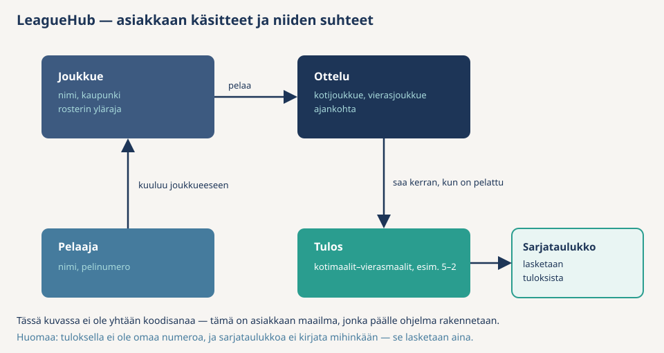

Kaksi riviä eroaa muista — paina ne mieleen, seuraavassa osiossa niille on nimet:

- **Tulos** ei ole samanlainen "oma asiansa" kuin joukkue. Se on kaksi lukua, jotka kuuluvat yhteen. Kukaan ei kysy "mikä on tulos numero 7" — kysytään "mikä oli ottelun 7 tulos".
- **Sarjataulukkoa** ei kirjata mihinkään. Se lasketaan aina tuloksista. Jos jokin tulos muuttuisi, taulukko muuttuisi itsestään.

**2. Tekemiset**

- Perusta joukkue
- Lisää pelaaja joukkueeseen
- Sovi ottelu (koti, vieras, ajankohta)
- Kirjaa ottelun tulos
- Katso joukkueet, rosteri, ottelut ja sarjataulukko

**3. Säännöt** — asiakkaan suusta, ei koodista:

| Sääntö | Miksi asiakas välittää |
|--------|------------------------|
| Joukkueella on nimi ja rosterin yläraja on positiivinen | Nimetön joukkue tai nollan paikan rosteri ei ole joukkue |
| Rosteri ei ylitä ylärajaa | Täyteen joukkueeseen ei mahdu lisää |
| Pelaajalla on nimi ja positiivinen pelinumero | Paidassa ei ole numeroa 0 tai −5 |
| Pelinumero on joukkueessa vain kerran | Kentällä ei ole kahta samaa numeroa samassa paidassa |
| Koti ja vieras eivät ole sama joukkue | Joukkue ei pelaa itseään vastaan |
| Tulos kirjataan vain kerran, vasta kun ottelu on pelattu, eikä maaleja ole negatiivisia | Toimeksiantaja ei hyväksy mahdottomia tuloksia |
| Ottelun molemmat joukkueet ovat olemassa | Ottelua ei sovita keksitylle joukkueelle |

Lisäksi yksi käytännön vaatimus: kirjaukset eivät saa kadota, kun järjestelmä sammutetaan. Tähän palataan vasta paljon myöhemmin — se on tekniikkaa, ei asiakkaan maailman sääntö.

</details>

### Checkpoint

Mieti, mikä LeagueHub on, käyttämättä yhtään näistä sanoista: *API, tietokanta, luokka, endpoint*. Jos pystyt, ymmärrät asiakkaan maailman.

Vielä yksi tarkistus: kumpi kuulostaa asiakkaan lauseelta — "pelinumero on joukkueessa vain kerran" vai "Players-taulussa on uniikki-indeksi"? Ensimmäinen. Jälkimmäinen on toteutusta, ja se päätetään vasta paljon myöhemmin.

Tapa, jolla juuri työskentelit — asiakkaan käsitteet ja säännöt ensin, tekniikka myöhemmin — on DDD:n ydin. Seuraavassa osiossa listasi käsitteet saavat viralliset DDD-nimet.

</details>

---

<details>
<summary>Ohjattu osio 4 — Käsitteistä DDD:ksi</summary>

**Miksi tämä osio?** Osiossa 3 kirjoitit LeagueHubin käsitteet, tekemiset ja säännöt asiakkaan kielellä. **Domain-Driven Design (DDD)** on suunnittelutapa, jonka ydinajatus on juuri tämä: **ohjelman rakenne seuraa asiakkaan maailmaa**, ei tietokantaa eikä teknistä toteutusta. Sana *domain* tarkoittaa sitä maailmaa, jota ohjelma palvelee — tässä harrastesarjaa.

Tässä osiossa käyt osion 3 listat läpi neljänä askeleena. Jokainen askel antaa yhdelle listan osalle DDD-nimen. Kun osio on ohi, tiedät mitä luokkia koodiin tulee — ennen kuin yhtään riviä on kirjoitettu.

> Tällä kurssilla DDD:stä käytetään vain **taktinen taso**: miten *yhden* mallin asiat nimetään ja mihin säännöt kuuluvat. **Strateginen taso** kysyy, onko järjestelmässä useita malleja — esim. `Player` sarjassa ei ole sama kuin kirjautumisen käyttäjä. Sitä rajaa kutsutaan bounded contextiksi. LeagueHub on yksi sellainen, joten siihen ei törmätä. Domain eventit ja event sourcing eivät kuulu tähän kertaan.

### Askel 1: Käsitteet — kaksi lappua

Ajattele kahta lappua, joissa lukee sama asia. Kysymys on vain: **ovatko ne silti kaksi eri juttua?**

**Entiteetti — kyllä, ne ovat eri.**  
Kaksi ihmistä nimeltä Matti. Sama nimi, sama syntymäpäivä. Silti kaksi ihmistä. Toinen voi vaihtaa nimensä — hän on yhä sama ihminen. Siksi tarvitaan erottaja, koodissa `Id`.

LeagueHubissa: kahdessa joukkueessa voi olla “Matti, numero 10”. He ovat eri pelaajia. Joukkue ja ottelu samoin: kaksi 5–2-ottelua eri päivinä ovat eri otteluita.

**Value object — ei, ne ovat sama asia.**  
Sinä kirjoitat `matti@example.com`. Minä kirjoitan saman. Se on yksi osoite, ei kaksi.  
Sinun 10 € ja minun 10 € ovat sama summa.  
Tulos 2–1 ja toinen 2–1 ovat sama tulos. Kukaan ei sano “tulos numero 7”.

Value objectia ei *muokata* jälkikäteen — jos arvo on väärä, tehdään kokonaan uusi arvo. Lappuun ei raaputeta korjausta, vaan kirjoitetaan uusi lappu.

**Ei kumpikaan — se ei ole edes “asia”, se on luku jonkun tiedoissa.**  
Ikä 25 ei tarvitse omaa luokkaa — se on luku henkilön tiedoissa.  
Pelinumero 10 samoin: luku pelaajan tiedoissa.  
Sarjataulukkoa ei kirjata mihinkään — se lasketaan joka kerta uudelleen otteluista.

| DDD-nimi | Yhdellä lauseella | LeagueHubissa |
|----------|-------------------|----------------|
| **Entiteetti** | Yksilö. Tiedot saavat muuttua, `Id` erottaa. | `Team`, `Player`, `Match` |
| **Value object** | Pelkkä arvo. Kaksi samaa arvoa ovat sama asia. Ei `Id`:tä. | `Score` (2–1 on 2–1) |
| **Ei kumpikaan** | Yksi luku tai laskettu lista jonkun *sisällä*. | pelinumero, sarjataulukko |

#### Yritä itse — luokittele käsitteet

Käy osion 3 käsitelistasi läpi. Merkitse jokaiseen: entiteetti, value object vai ei kumpikaan? Listalla: joukkue, pelaaja, ottelu, tulos, pelinumero, sarjataulukko.

<details>
<summary>Malli — luokittelu</summary>

Kysy aina: **jos kaksi lappua näyttää samalta, ovatko ne silti eri asiat?**

**LeagueHubin lista**

- **Joukkue, pelaaja, ottelu = entiteettejä.** Kaksi Mattia numerolla 10 eri joukkueissa ovat eri pelaajia. Siksi `Id`.
- **Tulos = value object** (koodissa `Score`). 2–1 on 2–1. Kotimaalit ja vierasmaalit kuuluvat yhteen: tulos on joko kunnossa tai sitä ei ole.
- **Pelinumero = ei kumpikaan.** Se on yksi luku pelaajan tiedoissa. `Player.Create` tarkistaa, että numero on positiivinen. Älä tee siitä value objectia siksi, että “DDD:ssä pitää olla VO”. `Score` on VO, koska siinä on *kaksi* lukua yhdessä.
- **Sarjataulukko = ei kumpikaan.** Sitä ei kirjata. Se lasketaan tuloksista. Nimi tälle tulee askeleessa 4.

**Muita esimerkkejä** (älä koodaa näitä; harjoittele vain kysymystä)

| Asia | Kaksi lappua — eri vai sama? | Päätös |
|------|------------------------------|--------|
| Henkilö | Kaksi ihmistä, sama nimi ja syntymäpäivä. Silti kaksi ihmistä. | Entiteetti |
| Lasku | Kaksi laskua, molemmat 50 €. Silti kaksi laskua. | Entiteetti |
| Kirjaston kirja hyllyssä | Kaksi kappaletta samaa teosta. Toinen lainassa, toinen kotona. | Entiteetti |
| Sähköpostiosoite | Sinä kirjoitat `matti@example.com`. Minä kirjoitan saman. Yksi osoite, ei kaksi. | Value object |
| Osoite (katu, postinumero, kaupunki) | Sama katu, sama numero, sama kaupunki. Yksi paikka. | Value object |
| Rahasumma 10 € | Sinun 10 € ja minun 10 €. Sama summa, ei kaksi eri “kymppiä”. | Value object |
| Ikä tai “montako paitaa” | “25 vuotta” ei ole oma asiansa. Se on luku henkilön tiedoissa. | Ei kumpikaan — älä tee omaa luokkaa |
| Kuukauden tilasto tai raportti | Tilastoa ei kirjata. Se lasketaan joka kerta, kuten sarjataulukko. | Ei kumpikaan |

</details>

### Askel 2: Säännöt → invariantit — ja säännön koti

Osion 3 sääntölista ("nimi ei tyhjä", "tulos vain kerran", "maalit eivät negatiivisia") saa DDD-nimen **invariantti**: sääntö, jonka pitää olla voimassa **aina**, kun olio on olemassa. Ei "tarkistetaan joskus lomakkeella", vaan: virheellistä `Match`-oliota ei pysty edes luomaan.

Tästä seuraa DDD:n toinen ydinajatus: **sääntö asuu sen datan vieressä, jota se koskee.** "Tulos vain kerran" koskee ottelun omaa dataa — siis sääntö on `Match`-luokassa, ei jossain muualla. Kun entiteetillä on metodeja, jotka muuttavat tilaa vain sääntöjen kautta (`Match.RecordResult`, `Team.EnsureCanAddPlayer`), puhutaan **rikkaasta mallista**. Vastakohta — pelkkä tietosäiliö, jonka säännöt ovat hajallaan muissa luokissa — tulee vastaan peilauksessa osiossa 13.

### Askel 3: Tekemiset → use caset

Osion 3 tekemislista ("perusta joukkue", "kirjaa tulos"…) saa nimen **use case**: yksi käyttötapaus, yksi luokka. Esimerkiksi "kirjaa ottelun tulos" → `RecordMatchResultUseCase`. Use casen työnkuva on aina sama kolmen kohdan resepti: **hae oliot, kutsu domainia, tallenna.** Se ei itse sisällä sarjan sääntöjä — ne asuvat entiteeteissä (askel 2).

### Askel 4: Sarjataulukko → lukumalli

Sarjataulukko lasketaan tuloksista eikä sitä tallenneta — siksi se ei ole entiteetti. Sille tulee oma pieni luokka (`Standing`), jota kutsutaan **lukumalliksi**: dataa, joka lasketaan entiteeteistä lukemista varten.

### Koko muunnos yhdellä silmäyksellä

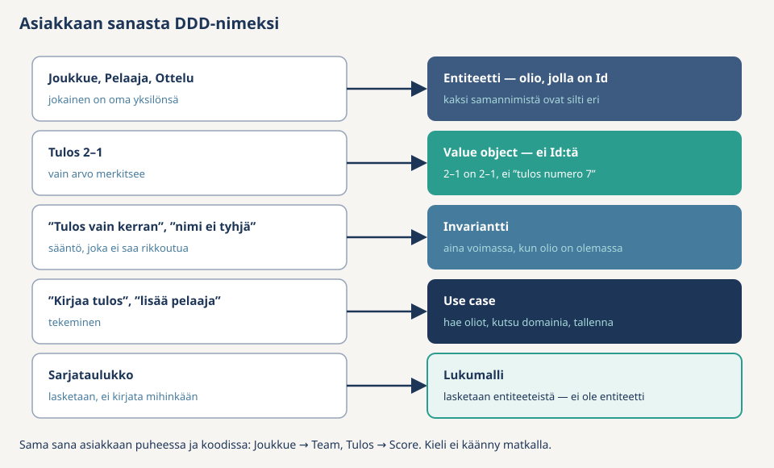

Huomaa kuvan alarivi: asiakkaan sana ja koodin nimi ovat **sama sana** (Joukkue → `Team`, Tulos → `Score`). Kun asiakas sanoo "tuloksen saa kirjata vain kerran", tiedät heti, mihin luokkaan katsoa.

### Mihin sääntö kuuluu?

Askel 2 sanoi: sääntö asuu datansa vieressä. Mutta kaikki säännöt eivät mahdu yhden olion sisään. Nyrkkisääntö:

| Kysymys | Sijoitus | Esimerkki osion 3 listasta |
|---------|----------|----------------------------|
| Koskeeko sääntö **yhden olion omaa dataa**? | Entiteetti (tai VO) | Koti ≠ vieras; tulos vain kerran; pelinumero > 0 |
| Vaatiiko sääntö **hakua tai toista oliota**, jota tällä entiteetillä ei ole? | Use case | Molemmat joukkueet *ovat olemassa*; pelinumero *uniikki joukkueessa* |

Pelinumerolla on **kaksi** sääntöä ja **kaksi** osoitetta: positiivisuus on pelaajan omaa dataa (`Player.Create`), mutta uniikkius vaatii joukkueen muut pelaajat — se on use casen työtä.


#### Yritä itse — säännön paikka

Sijoita nämä neljä riviä (entiteetti, use case vai jokin muu?) *ennen* kuin avaat mallin:

- `if (homeTeamId == awayTeamId)`
- `if (roster.Any(p => p.Number == number))`
- `if (_teams.GetById(homeTeamId) is null)`
- `return BadRequest(...)`

<details>
<summary>Malli — säännön paikka</summary>

Ensimmäinen entiteetti (`Match.Create` — ottelun omaa dataa), toinen use case (uniikkius vaatii muut pelaajat), kolmas use case (vaatii haun), neljäs ei kumpikaan — se on HTTP:tä, ja sille kerrokselle annetaan nimi osiossa 5. Jos laitoit kaikki samaan luokkaan, palaa taulukkoon "Mihin sääntö kuuluu?".

</details>

### Checkpoint

Osaat sanoa omin sanoin, mikä on entiteetti, value object, invariantti ja use case — ja miksi `Score` on value object mutta pelinumero ei. Jos jokin nimistä on hämärä, palaa sen askeleeseen: jokainen nimi syntyi jostain osion 3 listan rivistä.

</details>

---

<details>
<summary>Ohjattu osio 5 — Projektin rakenne: ensimmäinen CA</summary>

**Miksi tämä osio?** DDD kertoi, *mitä* oliot ovat. **Clean Architecture** kertoo, *mihin projektiin* ne laitetaan. Kerrokset ovat erillisiä projekteja: projektiviittaus määrää, mitä koodi näkee. Jos Domainilla ei ole viittausta Infrastructureen, `using LeagueHub.Infrastructure` ei käänny.

### Neljä kerrosta

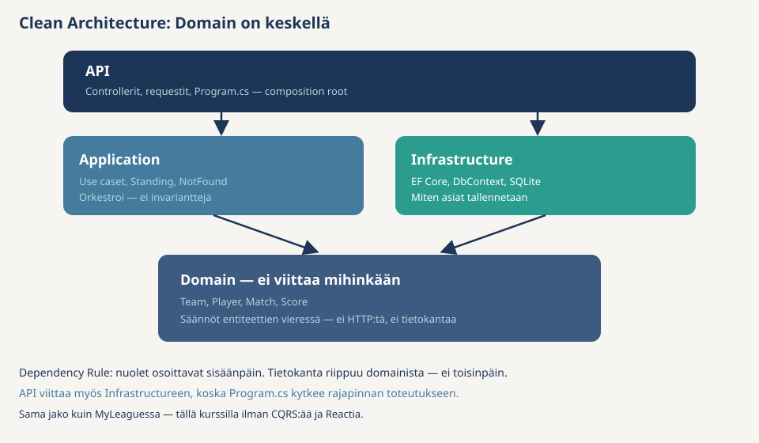

Sama jako näkyy MyLeaguessa (siellä lisäksi CQRS ja React). Tällä kerralla riittävät use caset ja Swagger:

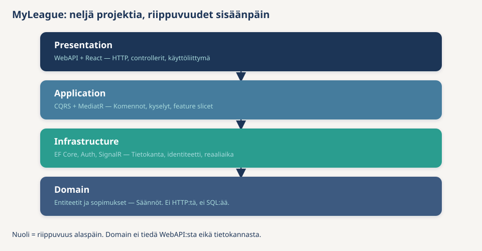

**Dependency Rule:** riippuvuudet osoittavat aina **sisäänpäin**, kohti Domainia.

| Kerros | Mitä siellä on (osion 3–4 sanoin) | Mihin se saa viitata |
|--------|-----------------------------------|----------------------|
| **Domain** | Entiteetit, value objectit, säännöt (`Team`, `Score`, “tulos vain kerran”) | Ei mihinkään |
| **Application** | Use caset ja lukumallit (“kirjaa tulos”, sarjataulukko) | Vain Domainiin |
| **Infrastructure** | Miten asiat *tallennetaan* (tietokanta, tiedosto) | Domainiin |
| **API** | HTTP: reitit, controllerit, `Program.cs` | Applicationiin ja Infrastructureen |

Tietokanta riippuu domainista — ei toisinpäin. Tallennuksen rajapinta (`ITeamRepository`) tulee osiossa 6, kun Domain rakennetaan. Älä jää nyt jumiin siihen.

API on **composition root** — ohjelman kytkentäpaikka. *Composition* = kokoaminen, *root* = juuri eli lähtöpiste.

Sisemmät kerrokset eivät luo toisilleen olioita. Use case pyytää konstruktorissa `ITeamRepositoryn`, mutta ei tiedä luokkaa `TeamRepository`. Jos Application tekisi `new TeamRepository()`, sen pitäisi viitata Infrastructureen — Dependency Rule rikkoutuisi.

Joku uloin paikka joutuu sanomaan: "kun tarvitaan `ITeamRepository`, anna `TeamRepository`." Se paikka on API:n `Program.cs` (osio 9). Siksi API viittaa sekä Applicationiin että Infrastructureen. Controllerit eivät silti kutsu tietokantaa — ne kutsuvat use caseja. Infrastructure-viittaus on vain kytkentää varten.

Osioiden 3–4 asiat kerroksiin:

| Asia | Kerros | Miksi |
|------|--------|-------|
| Joukkue, pelaaja, ottelu (`Team` …) | Domain | Entiteetit: yksilöt ja niiden säännöt. Eivät tiedä HTTP:stä eivätkä tietokannasta. |
| Tulos (`Score`) | Domain | Value object: kuuluu ottelun sääntöihin. |
| “Tulos vain kerran” | Domain | Sääntö asuu ottelun vieressä (`Match.RecordResult`). |
| “Kirjaa tulos” (use case) | Application | Tekeminen: hakee ottelun, kutsuu domainia, tallentaa. Ei itse sisällä sääntöä. |
| Sarjataulukko (`Standing`) | Application | Lasketaan tuloksista. Ei tallenneta, ei ole entiteetti. |
| Tietokanta (SQLite) | Infrastructure | Tekniikka. Domain ei saa tietää tästä. |
| HTTP-reitti / controller | API | Reitit ja statuskoodit. Ei sääntöjä. |
| `Program.cs` | API | Composition root: ainoa tiedosto, jossa rajapinta kytketään toteutukseen (`ITeamRepository` → `TeamRepository`). |

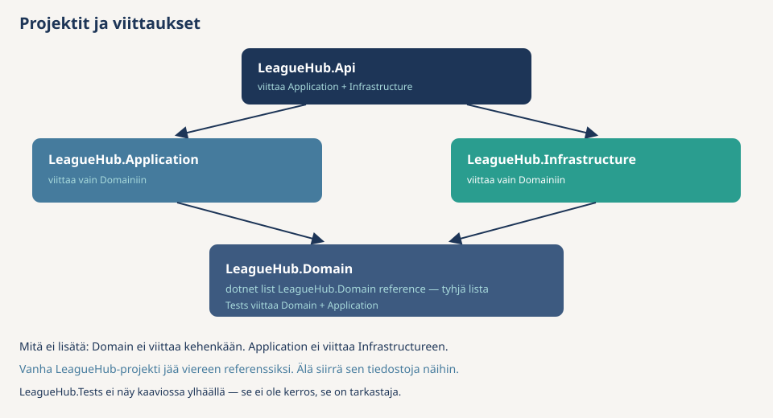

### Luo tyhjä talo

Kartta on paperilla. Nyt luodaan projektit ja viittaukset — vielä ilman luokkia. Sitten kääntäjä valvoo rakennetta, kun täytät kerrokset osioissa 6–11.

**Älä muokkaa** vanhaa `LeagueHub/`-projektia. Jos samassa kansiossa on jo `LeagueHub.sln`, uuden nimi on `LeagueHub.Clean.sln`. Jos käytät osiossa 2 suositeltua kurssirepoa, luo tämä solution kansioon `02-CleanArchitecture/` — ei vanhan `LeagueHub`-projektin sisään.

<details>
<summary>Komentorivi</summary>

Kansiosta, johon haluat uuden solutionin (esim. `02-CleanArchitecture/`):

```bash
dotnet new sln -n LeagueHub.Clean
dotnet new classlib -n LeagueHub.Domain
dotnet new classlib -n LeagueHub.Application
dotnet new classlib -n LeagueHub.Infrastructure
dotnet new webapi -n LeagueHub.Api --use-controllers
dotnet new xunit -n LeagueHub.Tests

dotnet sln LeagueHub.Clean.sln add LeagueHub.Domain LeagueHub.Application LeagueHub.Infrastructure LeagueHub.Api LeagueHub.Tests
```

`--use-controllers` on tärkeä: ilman sitä API on Minimal API.

Projektiviittaukset — nämä rivit **ovat** Dependency Rule:

```bash
dotnet add LeagueHub.Application reference LeagueHub.Domain
dotnet add LeagueHub.Infrastructure reference LeagueHub.Domain
dotnet add LeagueHub.Api reference LeagueHub.Application LeagueHub.Infrastructure
dotnet add LeagueHub.Tests reference LeagueHub.Domain LeagueHub.Application
```

Huomaa mitä **ei** lisätty: Domain ei viittaa mihinkään. Application ei tiedä Infrastructuresta eikä API:sta.

</details>

<details>
<summary>Visual Studio</summary>

1. **File → New → Project** → *Blank Solution*, nimeksi `LeagueHub.Clean`. Tallenna omaan kansioon (esim. `02-CleanArchitecture/`), ei vanhan `LeagueHub`-projektin sisään.
2. Solutionin päällä **Add → New Project**:
   - kolme kertaa **Class Library** (C#): `LeagueHub.Domain`, `LeagueHub.Application`, `LeagueHub.Infrastructure`
   - kerran **ASP.NET Core Web API**: `LeagueHub.Api` — Use controllers, OpenAPI/Swagger päällä, ei authia
   - kerran **xUnit Test Project**: `LeagueHub.Tests`
3. Viittaukset: projektin päällä **Add → Project Reference**:
   - Application → Domain
   - Infrastructure → Domain
   - Api → Application ja Infrastructure
   - Tests → Domain ja Application
4. Älä lisää viittausta Domain → mihinkään.

</details>

Siivoa pohjat:

- Poista `Class1.cs` jokaisesta classlib-projektista
- Poista `LeagueHub.Api`-projektista `WeatherForecastController.cs` ja `WeatherForecast.cs`
- Poista `LeagueHub.Tests`-projektista pohjatesti (`UnitTest1.cs`)

```bash
dotnet build LeagueHub.Clean.sln
```

### Checkpoint

Solution Explorerissa (tai kansiossa) pitää näkyä nämä projektit — luokkia ei vielä ole:

```
LeagueHub.Clean.sln
├── LeagueHub.Domain/
├── LeagueHub.Application/
├── LeagueHub.Infrastructure/
├── LeagueHub.Api/
└── LeagueHub.Tests/
```

Viittaukset: Application → Domain, Infrastructure → Domain, Api → Application ja Infrastructure, Tests → Domain ja Application. Domainilla ei ole viittauksia.

</details>

---

# Kerrokset pala kerrallaan

Talo on pystyssä. Seuraavissa osioissa täytetään yksi kerros kerrallaan. Pelaaja on mukana ohjatussa — soveltavassa lisäät *uuden* ominaisuuden itse.

---

<details>
<summary>Ohjattu osio 6 — Domain</summary>

**Miksi tämä osio?** Sovelluksen sydän rakennetaan ensin. Tavoite: jos `Match`-olio on ylipäätään olemassa, sen säännöt ovat voimassa — virheellistä oliota ei pysty edes luomaan. Silloin muut kerrokset voivat luottaa siihen tarkistamatta mitään uudelleen.

### Mitä tehdään?

Luo `LeagueHub.Domain`-projektiin kansiot `Entities`, `ValueObjects`, `Exceptions` ja `Interfaces`. Domainiin tulee **rajapinta** `ITeamRepository` — toteutus, `DbContext` ja controllerit tulevat myöhemmin.

**1. `Exceptions/DomainException.cs`**

Kun sääntö rikkoutuu (osio 4: invariantti), Domainin pitää kertoa siitä kutsujalle. Siihen käytetään poikkeusta: “tätä oliota ei saa luoda” tai “tätä muutosta ei saa tehdä.”

Pelkkä `throw new Exception(...)` ei riitä. API:n pitää osiossa 9 erottaa kaksi tilannetta: *sääntö rikkoutui* → HTTP 400, *oliota ei löydy* → HTTP 404. Jos molemmat heittäisivät saman `Exceptionin`, controller ei tietäisi kumpaa koodia palauttaa.

Siksi Domainilla on **oma** poikkeustyyppi. Se asuu Domainissa, koska Dependency Rule kieltää Domainia viittaamasta Applicationiin tai API:in — `BadRequest` tai `NotFoundException` eivät saa tulla tänne. `Team`, `Player`, `Match` ja `Score` heittävät kaikki saman tyypin. API saa myöhemmin yhden `catch (DomainException)` -haaran.

```csharp
namespace LeagueHub.Domain.Exceptions;

public class DomainException : Exception
{
    public DomainException(string message) : base(message) { }
}
```

**2. `ValueObjects/Score.cs`** — osion 4 value object: kaksi maalia, jotka kuuluvat yhteen. Ei `Id`:tä: 5–2 on 5–2. `Create` heittää `DomainExceptionin`, jos maalit ovat negatiivisia.

```csharp
using LeagueHub.Domain.Exceptions;

namespace LeagueHub.Domain.ValueObjects;

public sealed class Score
{
    public int HomeGoals { get; }
    public int AwayGoals { get; }

    private Score(int homeGoals, int awayGoals)
    {
        HomeGoals = homeGoals;
        AwayGoals = awayGoals;
    }

    public static Score Create(int homeGoals, int awayGoals)
    {
        if (homeGoals < 0 || awayGoals < 0)
        {
            throw new DomainException("Maalit eivät voi olla negatiivisia.");
        }

        return new Score(homeGoals, awayGoals);
    }
}
```

**3. `Entities/Team.cs`** — entiteetti (osio 4): `Create` on ainoa reitti sisään, setterit privaatteja. Ulkopuolelta rivi `team.MaxRoster = 0` ei käänny. Parametriton `private Team()` on EF Corea varten: kanta täyttää olion ilman `Create`-kutsua. `EnsureCanAddPlayer` on täällä, koska `MaxRoster` on joukkueen oma kenttä. Pelaajalistaa `Team` ei hae — määrä tulee parametrina, use case täyttää sen osiossa 7.

```csharp
using LeagueHub.Domain.Exceptions;

namespace LeagueHub.Domain.Entities;

public class Team
{
    public int Id { get; private set; }
    public string Name { get; private set; } = string.Empty;
    public string City { get; private set; } = string.Empty;
    public int MaxRoster { get; private set; }

    private Team() { }

    public static Team Create(string name, string city, int maxRoster)
    {
        if (string.IsNullOrWhiteSpace(name))
        {
            throw new DomainException("Joukkueen nimi on pakollinen.");
        }

        if (maxRoster <= 0)
        {
            throw new DomainException("Rosterin ylärajan pitää olla positiivinen.");
        }

        return new Team
        {
            Name = name.Trim(),
            City = city?.Trim() ?? string.Empty,
            MaxRoster = maxRoster
        };
    }

    public void EnsureCanAddPlayer(int currentPlayerCount)
    {
        if (currentPlayerCount >= MaxRoster)
        {
            throw new DomainException("Roster on täynnä.");
        }
    }

    internal void AssignId(int id) => Id = id;
}
```

`AssignId` on `internal`: vain sama assembly ja testit (osio 11) saavat asettaa tunnisteen. EF Core asettaa `Id`:n private settereiden kautta.

**4. `Entities/Player.cs`** — oma entiteetti, jolla on `TeamId` (ei `List<Player>` `Teamin` sisällä). Täällä vain pelaajan oma data: nimi ja positiivinen pelinumero. Rosterin raja ja numeron uniikkius vaativat muita olioita — osion 4 nyrkkisääntö vie ne use caseen.

```csharp
using LeagueHub.Domain.Exceptions;

namespace LeagueHub.Domain.Entities;

public class Player
{
    public int Id { get; private set; }
    public int TeamId { get; private set; }
    public string Name { get; private set; } = string.Empty;
    public int Number { get; private set; }

    private Player() { }

    public static Player Create(int teamId, string name, int number)
    {
        if (string.IsNullOrWhiteSpace(name))
        {
            throw new DomainException("Pelaajan nimi on pakollinen.");
        }

        if (number <= 0)
        {
            throw new DomainException("Pelinumeron pitää olla positiivinen.");
        }

        return new Player
        {
            TeamId = teamId,
            Name = name.Trim(),
            Number = number
        };
    }

    internal void AssignId(int id) => Id = id;
}
```

**5. `Entities/Match.cs`** — entiteetti: ottelulla on `Id`, ja sen tiedot saavat muuttua (tulos kirjataan myöhemmin).

`Create` tarkistaa vain ottelun oman datan: kotijoukkue ja vierasjoukkue eivät saa olla sama. Sääntö “molemmat joukkueet ovat olemassa” ei ole täällä. `Match` näkee vain kaksi lukua (`HomeTeamId`, `AwayTeamId`) — se ei osaa kysyä tietokannalta, onko joukkue oikeasti kannassa. Haku kuuluu use caseen (osio 4).

`RecordResult` kirjaa tuloksen. Kaksi sääntöä: tulos vain kerran (`HasResult`), ja ottelun ajankohta ei saa olla tulevaisuudessa. Vertailuun tarvitaan “mikä hetki on nyt”. Jos metodi kutsuisi itse `DateTime.UtcNow`, testi ei voisi teeskennellä, että kello on ennen tai jälkeen ottelun. Siksi `now` tulee parametrina: use case antaa oikean kellonajan, testi antaa valitsemansa ajan (osio 11).

Esimerkki: ottelu on sovittu lauantaille 12.9.2026 klo 18.00 (`ScheduledAt`). Testi “tulosta ei saa kirjata ennen ottelua” kutsuu `RecordResult(score, now: 12.9.2026 klo 17.00)` — kello on tunti ennen alkua, joten metodin pitää heittää `DomainException`. Testi “tulos kelpaa pelatulle ottelulle” antaa `now: 12.9.2026 klo 20.00`. Jos `Match` lukisi kellon itse, molemmat testit riippuisivat siitä, milloin ne ajetaan.

```csharp
using LeagueHub.Domain.Exceptions;
using LeagueHub.Domain.ValueObjects;

namespace LeagueHub.Domain.Entities;

public class Match
{
    public int Id { get; private set; }
    public int HomeTeamId { get; private set; }
    public int AwayTeamId { get; private set; }
    public DateTime ScheduledAt { get; private set; }
    public int? HomeGoals { get; private set; }
    public int? AwayGoals { get; private set; }

    public bool HasResult => HomeGoals is not null;

    private Match() { }

    public static Match Create(int homeTeamId, int awayTeamId, DateTime scheduledAt)
    {
        if (homeTeamId == awayTeamId)
        {
            throw new DomainException("Koti ja vieras eivät voi olla sama joukkue.");
        }

        return new Match
        {
            HomeTeamId = homeTeamId,
            AwayTeamId = awayTeamId,
            ScheduledAt = scheduledAt
        };
    }

    public void RecordResult(Score score, DateTime now)
    {
        if (HasResult)
        {
            throw new DomainException("Tulos on jo kirjattu.");
        }

        if (ScheduledAt > now)
        {
            throw new DomainException("Ottelu ei ole vielä pelattu.");
        }

        HomeGoals = score.HomeGoals;
        AwayGoals = score.AwayGoals;
    }

    internal void AssignId(int id) => Id = id;
}
```

**6. Repository-rajapinnat.** Domain kertoo, *mitä* se tarvitsee tallennukselta — ei *miten*. Toteutus (EF) tulee osioon 8.

Metodit eivät synny “CRUD-paketista” (luo, lue, päivitä, poista). Ne syntyvät osion 3 tekemisistä: perusta joukkue, lisää pelaaja, sovi ottelu, kirjaa tulos, katso listat. Jokainen tekeminen tarvitsee haun tai tallennuksen — se rivi tulee rajapintaan. Jos tekemistä ei ole, metodia ei ole.

Siksi nyt **ei ole** `Delete` / `Remove`. Asiakas ei pyytänyt “poista joukkue” tai “peru ottelu”. Älä lisää metodia siltä varalta, että sitä ehkä tarvitaan myöhemmin. Soveltavassa tulee siirto — silloin `IPlayerRepositoryyn` lisätään se, mitä siirto oikeasti tarvitsee.

| Tekeminen (osio 3) | Mitä tallennukselta kysytään |
|--------------------|------------------------------|
| Katso joukkueet / ottelut | `GetAllAsync` |
| Perusta joukkue / lisää pelaaja / sovi ottelu | `AddAsync` |
| “Joukkue on olemassa”, “hae ottelu tulosta varten” | `GetByIdAsync` |
| Katso rosteri | `GetByTeamIdAsync` |
| Kirjaa tulos (olio on jo olemassa, sen tila muuttuu) | `UpdateAsync` vain `IMatchRepositoryssa` |
| Poista jotain | ei metodia — tekemistä ei ole |

Rajapinnassa ei myöskään ole sääntöjä (`IsNumberTaken`, `IsResultAlreadyRecorded`). Haku palauttaa dataa; sääntö kuuluu entiteettiin tai use caseen.

**`Interfaces/ITeamRepository.cs`**

```csharp
using LeagueHub.Domain.Entities;

namespace LeagueHub.Domain.Interfaces;

public interface ITeamRepository
{
    Task<List<Team>> GetAllAsync();
    Task<Team?> GetByIdAsync(int id);
    Task<Team> AddAsync(Team team);
}
```

**`Interfaces/IPlayerRepository.cs`**

```csharp
using LeagueHub.Domain.Entities;

namespace LeagueHub.Domain.Interfaces;

public interface IPlayerRepository
{
    Task<List<Player>> GetByTeamIdAsync(int teamId);
    Task<Player> AddAsync(Player player);
}
```

**`Interfaces/IMatchRepository.cs`**

```csharp
using LeagueHub.Domain.Entities;

namespace LeagueHub.Domain.Interfaces;

public interface IMatchRepository
{
    Task<List<Match>> GetAllAsync();
    Task<Match?> GetByIdAsync(int id);
    Task<Match> AddAsync(Match match);
    Task UpdateAsync(Match match);
}
```

### Miksi async?

Nämä metodit kutsuvat osiossa 8 tietokantaa. Tietokantakutsu on hidasta: ohjelma jää odottamaan vastausta levyltä tai verkon takaa (I/O). Jos metodi olisi tavallinen synkroninen metodi, se tukkisi säikeen odottamisen ajaksi.

**Async** tarkoittaa: metodi palauttaa heti `Task<T>`:n (“työ on kesken”) ja vapauttaa säikeen. Kun kanta vastaa, työ valmistuu. Nyrkkisääntö tällä kurssilla: jos metodi puhuu tietokannalle tai tiedostolle, sen paluuarvo on `Task` tai `Task<T>` ja nimen lopussa on `Async` (`GetByIdAsync`, `AddAsync`).

Käytät sitä osiossa 7: `await _teams.AddAsync(team)`. `await` tarkoittaa: odota, että tallennus valmistuu, mutta älä tuki palvelinta sillä välin.

### Checkpoint

`LeagueHub.Domain` näyttää tältä — muissa projekteissa ei ole vielä omia luokkia:

```
LeagueHub.Domain/
├── Entities/
│   ├── Team.cs
│   ├── Player.cs
│   └── Match.cs
├── ValueObjects/
│   └── Score.cs
├── Exceptions/
│   └── DomainException.cs
└── Interfaces/
    ├── ITeamRepository.cs
    ├── IPlayerRepository.cs
    └── IMatchRepository.cs
```

</details>

---

<details>
<summary>Ohjattu osio 7 — Application</summary>

**Miksi tämä osio?** Domain osaa sääntönsä. Joku hakee oliot, kutsuu niitä ja tallentaa. Se on **use case** — yksi luokka per käyttötapaus.

Use case **orkestroi** eli ohjaa tapahtuman kulun: hae oliot, kutsu domainia, tallenna. Se ei toista entiteetin sääntöjä — sille jäävät vain ne säännöt, jotka vaativat toisen olion tai tietokantahaun. Osion 4 nyrkkisääntö: “joukkue on olemassa” ja “numero uniikki” ovat täällä, “koti ≠ vieras” on `Match.Createssa`. HTTP 400 tulee vasta API:ssa.

### Mitä tehdään?

Luo kansiot `Exceptions`, `Models` ja `UseCases` (alle `Teams`, `Players` ja `Matches`).

**1. `Exceptions/NotFoundException.cs`** — “joukkuetta ei löydy” ei ole domainin sääntö. Domain ei tiedä tietokannasta. Kun haku palauttaa `null`, use case heittää tämän. API muuttaa sen osiossa 9 koodiksi 404. `DomainException` on 400 (sääntö rikkoutui). Siksi kaksi eri tyyppiä.

```csharp
namespace LeagueHub.Application.Exceptions;

public class NotFoundException : Exception
{
    public NotFoundException(string message) : base(message) { }
}
```

**2. `Models/Standing.cs`** — osion 4 lukumalli. Sarjataulukkoa ei tallenneta; se lasketaan otteluista. Siksi tämä luokka on Applicationissa, ei Domainin entiteetti.

```csharp
namespace LeagueHub.Application.Models;

public class Standing
{
    public int TeamId { get; set; }
    public string TeamName { get; set; } = string.Empty;
    public int Wins { get; set; }
    public int Draws { get; set; }
    public int Losses { get; set; }
    public int Points { get; set; }
}
```

**3. Use caset.** Jokainen luokka tekee yhden osion 3 tekemisistä. Resepti on aina: hae oliot → kutsu domainia → tallenna.

**`UseCases/Teams/CreateTeamUseCase.cs`** — yksinkertaisin tapaus: ei hakua. `Team.Create` validoi nimen ja rosterin ylärajan. Use case vain tallentaa.

```csharp
using LeagueHub.Domain.Entities;
using LeagueHub.Domain.Interfaces;

namespace LeagueHub.Application.UseCases.Teams;

public class CreateTeamUseCase
{
    private readonly ITeamRepository _teams;

    public CreateTeamUseCase(ITeamRepository teams)
    {
        _teams = teams;
    }

    public async Task<Team> ExecuteAsync(string name, string city, int maxRoster)
    {
        Team team = Team.Create(name, city, maxRoster);
        return await _teams.AddAsync(team);
    }
}
```

**`UseCases/Matches/CreateMatchUseCase.cs`** — “molemmat joukkueet ovat olemassa” vaatii haun, siksi se on täällä (`NotFoundException`). `Match.Create` tarkistaa edelleen koti ≠ vieras — sitä use case ei toista.

```csharp
using LeagueHub.Application.Exceptions;
using LeagueHub.Domain.Entities;
using LeagueHub.Domain.Interfaces;

namespace LeagueHub.Application.UseCases.Matches;

public class CreateMatchUseCase
{
    private readonly ITeamRepository _teams;
    private readonly IMatchRepository _matches;

    public CreateMatchUseCase(ITeamRepository teams, IMatchRepository matches)
    {
        _teams = teams;
        _matches = matches;
    }

    public async Task<Match> ExecuteAsync(int homeTeamId, int awayTeamId, DateTime scheduledAt)
    {
        if (await _teams.GetByIdAsync(homeTeamId) is null
            || await _teams.GetByIdAsync(awayTeamId) is null)
        {
            throw new NotFoundException("Molempien joukkueiden pitää olla olemassa.");
        }

        Match match = Match.Create(homeTeamId, awayTeamId, scheduledAt);
        return await _matches.AddAsync(match);
    }
}
```

**`UseCases/Players/AddPlayerToTeamUseCase.cs`** — neljä sääntöä, kaksi osoitetta (osio 4). Joukkue löytyy ja pelinumero on vapaa: haku, siis use case. Rosterin raja: `Team.EnsureCanAddPlayer`. Nimi ja numero kelvollisia: `Player.Create`.

```csharp
using LeagueHub.Application.Exceptions;
using LeagueHub.Domain.Entities;
using LeagueHub.Domain.Exceptions;
using LeagueHub.Domain.Interfaces;

namespace LeagueHub.Application.UseCases.Players;

public class AddPlayerToTeamUseCase
{
    private readonly ITeamRepository _teams;
    private readonly IPlayerRepository _players;

    public AddPlayerToTeamUseCase(ITeamRepository teams, IPlayerRepository players)
    {
        _teams = teams;
        _players = players;
    }

    public async Task<Player> ExecuteAsync(int teamId, string name, int number)
    {
        Team? team = await _teams.GetByIdAsync(teamId);

        if (team is null)
        {
            throw new NotFoundException("Joukkuetta ei löydy.");
        }

        List<Player> roster = await _players.GetByTeamIdAsync(teamId);

        team.EnsureCanAddPlayer(roster.Count);

        if (roster.Any(p => p.Number == number))
        {
            throw new DomainException("Pelinumero on jo käytössä joukkueessa.");
        }

        Player player = Player.Create(teamId, name, number);
        return await _players.AddAsync(player);
    }
}
```

**`UseCases/Matches/RecordMatchResultUseCase.cs`** — hakee ottelun. Jos sitä ei ole, `NotFoundException`. Sitten `Score.Create` ja `RecordResult` — negatiiviset maalit, toinen kirjaus ja “ottelu ei ole vielä pelattu” jäävät Domainiin. `DateTime.UtcNow` annetaan tässä; testi voi myöhemmin kutsua `RecordResult`ia suoraan omalla ajallaan.

```csharp
using LeagueHub.Application.Exceptions;
using LeagueHub.Domain.Entities;
using LeagueHub.Domain.Interfaces;
using LeagueHub.Domain.ValueObjects;

namespace LeagueHub.Application.UseCases.Matches;

public class RecordMatchResultUseCase
{
    private readonly IMatchRepository _matches;

    public RecordMatchResultUseCase(IMatchRepository matches)
    {
        _matches = matches;
    }

    public async Task<Match> ExecuteAsync(int matchId, int homeGoals, int awayGoals)
    {
        Match? match = await _matches.GetByIdAsync(matchId);

        if (match is null)
        {
            throw new NotFoundException("Ottelua ei löydy.");
        }

        Score score = Score.Create(homeGoals, awayGoals);
        match.RecordResult(score, DateTime.UtcNow);
        await _matches.UpdateAsync(match);
        return match;
    }
}
```

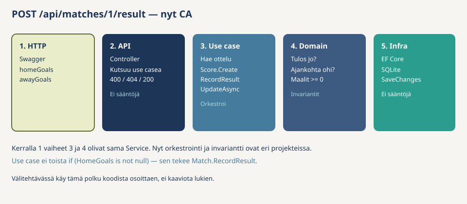

**4. `UseCases/Matches/GetStandingsUseCase.cs`** — pistelasku ei kuulu `Match`-entiteettiin: yksi ottelu ei tiedä koko sarjaa. Hae joukkueet ja ottelut, laske W / D / L niistä otteluista joissa `HasResult`, pisteet voitto 3 / tasapeli 1, palauta lista pisteiden mukaan laskevasti.

```csharp
using LeagueHub.Application.Models;
using LeagueHub.Domain.Entities;
using LeagueHub.Domain.Interfaces;

namespace LeagueHub.Application.UseCases.Matches;

public class GetStandingsUseCase
{
    private readonly ITeamRepository _teams;
    private readonly IMatchRepository _matches;

    public GetStandingsUseCase(ITeamRepository teams, IMatchRepository matches)
    {
        _teams = teams;
        _matches = matches;
    }

    public async Task<List<Standing>> ExecuteAsync()
    {
        List<Team> teams = await _teams.GetAllAsync();
        List<Match> matches = await _matches.GetAllAsync();

        List<Standing> rows = [];

        foreach (Team team in teams)
        {
            int wins = 0;
            int draws = 0;
            int losses = 0;

            foreach (Match match in matches)
            {
                if (!match.HasResult)
                {
                    continue;
                }

                bool isHome = match.HomeTeamId == team.Id;
                bool isAway = match.AwayTeamId == team.Id;

                if (!isHome && !isAway)
                {
                    continue;
                }

                int ours = isHome ? match.HomeGoals!.Value : match.AwayGoals!.Value;
                int theirs = isHome ? match.AwayGoals!.Value : match.HomeGoals!.Value;

                if (ours > theirs)
                {
                    wins++;
                }
                else if (ours == theirs)
                {
                    draws++;
                }
                else
                {
                    losses++;
                }
            }

            rows.Add(new Standing
            {
                TeamId = team.Id,
                TeamName = team.Name,
                Wins = wins,
                Draws = draws,
                Losses = losses,
                Points = wins * 3 + draws
            });
        }

        return rows.OrderByDescending(r => r.Points).ToList();
    }
}
```

**5. Listaukset.** Ei sääntöjä, vain haku. `GetTeamPlayersUseCase` tarkistaa ensin, että joukkue on olemassa.

**`UseCases/Teams/GetTeamsUseCase.cs`**

```csharp
using LeagueHub.Domain.Entities;
using LeagueHub.Domain.Interfaces;

namespace LeagueHub.Application.UseCases.Teams;

public class GetTeamsUseCase
{
    private readonly ITeamRepository _teams;

    public GetTeamsUseCase(ITeamRepository teams)
    {
        _teams = teams;
    }

    public Task<List<Team>> ExecuteAsync() => _teams.GetAllAsync();
}
```

**`UseCases/Matches/GetMatchesUseCase.cs`**

```csharp
using LeagueHub.Domain.Entities;
using LeagueHub.Domain.Interfaces;

namespace LeagueHub.Application.UseCases.Matches;

public class GetMatchesUseCase
{
    private readonly IMatchRepository _matches;

    public GetMatchesUseCase(IMatchRepository matches)
    {
        _matches = matches;
    }

    public Task<List<Match>> ExecuteAsync() => _matches.GetAllAsync();
}
```

**`UseCases/Players/GetTeamPlayersUseCase.cs`**

```csharp
using LeagueHub.Application.Exceptions;
using LeagueHub.Domain.Entities;
using LeagueHub.Domain.Interfaces;

namespace LeagueHub.Application.UseCases.Players;

public class GetTeamPlayersUseCase
{
    private readonly ITeamRepository _teams;
    private readonly IPlayerRepository _players;

    public GetTeamPlayersUseCase(ITeamRepository teams, IPlayerRepository players)
    {
        _teams = teams;
        _players = players;
    }

    public async Task<List<Player>> ExecuteAsync(int teamId)
    {
        if (await _teams.GetByIdAsync(teamId) is null)
        {
            throw new NotFoundException("Joukkuetta ei löydy.");
        }

        return await _players.GetByTeamIdAsync(teamId);
    }
}
```

### Checkpoint

`LeagueHub.Application` näyttää tältä:

```
LeagueHub.Application/
├── Exceptions/
│   └── NotFoundException.cs
├── Models/
│   └── Standing.cs
└── UseCases/
    ├── Teams/
    │   ├── CreateTeamUseCase.cs
    │   └── GetTeamsUseCase.cs
    ├── Players/
    │   ├── AddPlayerToTeamUseCase.cs
    │   └── GetTeamPlayersUseCase.cs
    └── Matches/
        ├── CreateMatchUseCase.cs
        ├── GetMatchesUseCase.cs
        ├── RecordMatchResultUseCase.cs
        └── GetStandingsUseCase.cs
```

</details>

---

<details>
<summary>Ohjattu osio 8 — Infrastructure</summary>

**Miksi tämä osio?** Data menee SQLite-tiedostoon. Tärkein opetus ei ole EF itse, vaan **sijainti**: Domain ja Application eivät saa `using Microsoft.EntityFrameworkCore` -riviä. `LeagueHubDbContext` ja repository-toteutukset ovat täällä. `TeamRepository` toteuttaa Domainin `ITeamRepositoryn`. EF-attribuutit (`[Required]`) eivät kuulu `Team.cs`:ään — mapping on `OnModelCreating`-metodissa.

### Mitä tehdään?

```bash
dotnet add LeagueHub.Infrastructure package Microsoft.EntityFrameworkCore.Sqlite
```

Luo kansiot `Persistence` ja `Repositories`.

**Persistence** tarkoittaa: data jää talteen, kun ohjelma sammutetaan. Kansio ei ole “Database” tai “EF”, koska Domain ei saa tietää SQLitestä — tässä on vain *miten asiat säilyvät*. Tänne tulevat `DbContext` ja seeder. `Repositories` on eri kansio, koska repository on sovelluksen käyttämä ovi (rajapinta Domainissa); toteutus vain sattuu käyttämään EFää. Infrastructureen voisi myöhemmin tulla muutakin kuin kanta (sähköposti, tiedosto) — sen takia tallennusta ei nimetä koko projektin mukaan.

**1. `Persistence/LeagueHubDbContext.cs`** — EF:n näkymä tauluihin. `OnModelCreating` kertoo sarakkeiden pituudet ja pakollisuudet. Näitä ei kirjoiteta `[Required]`-attribuutteina `Team.cs`:ään, jotta Domain ei viittaa EF:ään.

EF osaa täyttää olion, vaikka setterit ja konstruktori ovat privaatteja. Kun rivi luetaan kannasta, `Create`-factorya ei kutsuta uudelleen — validointi ajettiin jo oliota luotaessa. Aina pitäisi pyrkiä siihen, että tietokantaan ei pääse huonoa dataa ja tietokanan dataan pitäisi aina pystyä luottamaan. 

```csharp
using LeagueHub.Domain.Entities;
using Microsoft.EntityFrameworkCore;

namespace LeagueHub.Infrastructure.Persistence;

public class LeagueHubDbContext : DbContext
{
    public LeagueHubDbContext(DbContextOptions<LeagueHubDbContext> options) : base(options) { }

    public DbSet<Team> Teams => Set<Team>();
    public DbSet<Player> Players => Set<Player>();
    public DbSet<Match> Matches => Set<Match>();

    protected override void OnModelCreating(ModelBuilder modelBuilder)
    {
        modelBuilder.Entity<Team>(entity =>
        {
            entity.Property(t => t.Name).IsRequired().HasMaxLength(200);
            entity.Property(t => t.City).HasMaxLength(200);
        });

        modelBuilder.Entity<Player>(entity =>
        {
            entity.Property(p => p.Name).IsRequired().HasMaxLength(200);
            entity.Property(p => p.TeamId).IsRequired();
        });

        modelBuilder.Entity<Match>(entity =>
        {
            entity.Property(m => m.HomeTeamId).IsRequired();
            entity.Property(m => m.AwayTeamId).IsRequired();
        });
    }
}
```

**2. `Repositories/TeamRepository.cs`** — toteuttaa Domainin `ITeamRepositoryn`. Listaus käyttää `AsNoTracking()`: olioita ei muuteta, joten EF:n ei tarvitse seurata niitä. `GetByIdAsync` jättää seurannan päälle, koska haettua oliota saatetaan muuttaa (ottelu + `RecordResult`). Silloin `SaveChangesAsync` huomaa muutokset.

```csharp
using LeagueHub.Domain.Entities;
using LeagueHub.Domain.Interfaces;
using LeagueHub.Infrastructure.Persistence;
using Microsoft.EntityFrameworkCore;

namespace LeagueHub.Infrastructure.Repositories;

public class TeamRepository : ITeamRepository
{
    private readonly LeagueHubDbContext _context;

    public TeamRepository(LeagueHubDbContext context)
    {
        _context = context;
    }

    public async Task<List<Team>> GetAllAsync()
    {
        return await _context.Teams.AsNoTracking().ToListAsync();
    }

    public async Task<Team?> GetByIdAsync(int id)
    {
        return await _context.Teams.FirstOrDefaultAsync(t => t.Id == id);
    }

    public async Task<Team> AddAsync(Team team)
    {
        _context.Teams.Add(team);
        await _context.SaveChangesAsync();
        return team;
    }
}
```

**3. `Repositories/PlayerRepository.cs`** — sama kaava kuin `TeamRepository`. Listaus `AsNoTracking`, lisäys `Add` + `SaveChangesAsync`.

```csharp
using LeagueHub.Domain.Entities;
using LeagueHub.Domain.Interfaces;
using LeagueHub.Infrastructure.Persistence;
using Microsoft.EntityFrameworkCore;

namespace LeagueHub.Infrastructure.Repositories;

public class PlayerRepository : IPlayerRepository
{
    private readonly LeagueHubDbContext _context;

    public PlayerRepository(LeagueHubDbContext context)
    {
        _context = context;
    }

    public async Task<List<Player>> GetByTeamIdAsync(int teamId)
    {
        return await _context.Players
            .AsNoTracking()
            .Where(p => p.TeamId == teamId)
            .ToListAsync();
    }

    public async Task<Player> AddAsync(Player player)
    {
        _context.Players.Add(player);
        await _context.SaveChangesAsync();
        return player;
    }
}
```

**4. `Repositories/MatchRepository.cs`** — `GetByIdAsync` ilman `AsNoTracking`: ottelua muutetaan. `UpdateAsync` on pelkkä `SaveChangesAsync`, koska seurattu olio on jo muuttunut `RecordResult`issa. Erillistä `_context.Update(match)`-kutsua ei tarvita.

```csharp
using LeagueHub.Domain.Entities;
using LeagueHub.Domain.Interfaces;
using LeagueHub.Infrastructure.Persistence;
using Microsoft.EntityFrameworkCore;

namespace LeagueHub.Infrastructure.Repositories;

public class MatchRepository : IMatchRepository
{
    private readonly LeagueHubDbContext _context;

    public MatchRepository(LeagueHubDbContext context)
    {
        _context = context;
    }

    public async Task<List<Match>> GetAllAsync()
    {
        return await _context.Matches.AsNoTracking().ToListAsync();
    }

    public async Task<Match?> GetByIdAsync(int id)
    {
        return await _context.Matches.FirstOrDefaultAsync(m => m.Id == id);
    }

    public async Task<Match> AddAsync(Match match)
    {
        _context.Matches.Add(match);
        await _context.SaveChangesAsync();
        return match;
    }

    public async Task UpdateAsync(Match match)
    {
        await _context.SaveChangesAsync();
    }
}
```

**5. `Persistence/DbSeeder.cs`** — täyttää tyhjän kannan esimerkkidatalla, jotta Swaggerissa on heti joukkueita, pelaajia ja otteluita. Ilman seederiä avaisit tyhjän API:n ja joutuisit luomaan kaiken käsin.

`MigrateAsync` ajaa migraatiot (osio 10): jos tauluja ei vielä ole, ne luodaan. `if (Teams.Any()) return` estää tupladatan — toinen käynnistys ei lisää samoja joukkueita uudestaan.

Joukkueet tallennetaan **ensin** ja vasta sitten `SaveChangesAsync`. Vasta sen jälkeen EF täyttää `maila.Id`, `kiekko.Id` ja `sahly.Id`. Pelaaja ja ottelu tarvitsevat nuo id:t (`Player.Create(maila.Id, …)`, `Match.Create(maila.Id, kiekko.Id, …)`). Jos tallentaisit kaiken yhdellä kertaa ennen ensimmäistä tallennusta, id:t olisivat vielä nollia.

Seed kutsuu `Team.Create` / `Player.Create` / `Match.Create`, ei `new Team { Name = "…" }`. Sama rikas malli suojaa alkudataa: nimetön joukkue tai negatiivinen pelinumero ei pääse kantaan tätäkään reittiä.

Kahdella joukkueella on pelinumero 7. Se on sallittu: uniikkius on joukkueen sisällä, ei koko sarjassa.

```csharp
using LeagueHub.Domain.Entities;
using Microsoft.EntityFrameworkCore;

namespace LeagueHub.Infrastructure.Persistence;

public static class DbSeeder
{
    public static async Task SeedAsync(LeagueHubDbContext context)
    {
        await context.Database.MigrateAsync();

        if (await context.Teams.AnyAsync())
        {
            return;
        }

        Team maila = Team.Create("Mikkelin Maila", "Mikkeli", 12);
        Team kiekko = Team.Create("Kouvolan Kiekko", "Kouvola", 12);
        Team sahly = Team.Create("Savonlinnan Sähly", "Savonlinna", 10);

        context.Teams.AddRange(maila, kiekko, sahly);
        await context.SaveChangesAsync();

        context.Players.AddRange(
            Player.Create(maila.Id, "Matti Meikäläinen", 7),
            Player.Create(maila.Id, "Teppo Testaaja", 10),
            Player.Create(kiekko.Id, "Kaisa Kiekkonen", 7));

        context.Matches.AddRange(
            Match.Create(maila.Id, kiekko.Id, DateTime.UtcNow.AddDays(-2)),
            Match.Create(kiekko.Id, sahly.Id, DateTime.UtcNow.AddDays(7)));

        await context.SaveChangesAsync();
    }
}
```

### Checkpoint

`LeagueHub.Infrastructure` näyttää tältä (migraatiot tulevat osiossa 10):

```
LeagueHub.Infrastructure/
├── Persistence/
│   ├── LeagueHubDbContext.cs
│   └── DbSeeder.cs
└── Repositories/
    ├── TeamRepository.cs
    ├── PlayerRepository.cs
    └── MatchRepository.cs
```

</details>

---

<details>
<summary>Ohjattu osio 9 — API</summary>

**Miksi tämä osio?** Ulkomaailma puhuu HTTP:tä: Swagger, selain, toinen ohjelma. Domain ja use case eivät tiedä reiteistä eivätkä statuskoodeista. **Controller** on ohut kuori: lukee JSON-pyynnön, kutsuu use casea ja muuttaa poikkeuksen statuskoodiksi. Siellä ei ole `if (match.HasResult)` eikä `roster.Any(...)` — säännöt ovat jo Domainissa.

Kytkentä — composition root osiosta 5 — kirjoitetaan `Program.cs`:ään. Controller pyytää use casen konstruktorissa; se ei tee `new GetTeamsUseCase(...)`.

### Pyynnön matka

Esimerkki: `POST /api/matches/1/result` ja runko `{ "homeGoals": 2, "awayGoals": 1 }`.

1. Swagger lähettää HTTP-pyynnön.
2. `MatchesController` lukee ottelun id:n URL:sta ja maalit bodysta, kutsuu `RecordMatchResultUseCase`.
3. Use case hakee ottelun, rakentaa `Score.Create`, kutsuu `RecordResult`, tallentaa.
4. Domain päättää, saako tuloksen kirjata.
5. Infrastructure kirjoittaa rivin SQLiteen.
6. Controller palauttaa 200, jos tulos tallentui. Jos sääntö rikkoutui, 400. Jos ottelua ei ole, 404.


### Mitä tehdään?

Nyt osion 3 tekemiset saavat HTTP-reitit. **GET** hakee listan. **POST** luo tai tekee (perusta joukkue, lisää pelaaja, sovi ottelu, kirjaa tulos). `{id}` on paikka URL:ssa, johon tulee numero — esim. `/api/teams/1/players`.

| Reitti | Osion 3 tekeminen |
|--------|--------------------|
| `GET /api/teams` | katso joukkueet |
| `POST /api/teams` | perusta joukkue (`name`, `city`, `maxRoster`) |
| `GET /api/teams/{id}/players` | katso rosteri |
| `POST /api/teams/{id}/players` | lisää pelaaja (`name`, `number`) |
| `GET /api/matches` | katso ottelut |
| `POST /api/matches` | sovi ottelu (`homeTeamId`, `awayTeamId`, `scheduledAt`) |
| `POST /api/matches/{id}/result` | kirjaa tulos (`homeGoals`, `awayGoals`) |
| `GET /api/standings` | katso sarjataulukko |

### Request-luokat

Luo kansio `Requests`. Nämä eivät ole domain-olioita. Asiakas lähettää JSONia, jossa on vain se, mitä hän täyttää: nimi, kaupunki, rosterin yläraja. `Team`-entiteetillä on jo `Id`, metodit ja säännöt — sitä ei voi täyttää suoraan lomakkeesta.

Tällaista “vain siirtoa varten” -luokkaa kutsutaan **DTO:ksi** (Data Transfer Object). `record` on lyhyt tapa kirjoittaa luokka, jolla on vain data. Kenttien nimet (`Name`, `City`) vastaavat JSON-avaimia (`name`, `city`) — ASP.NET Core yhdistää ne.

```csharp
namespace LeagueHub.Api.Requests;

public record CreateTeamRequest(string Name, string City, int MaxRoster);
```

```csharp
namespace LeagueHub.Api.Requests;

public record CreateMatchRequest(int HomeTeamId, int AwayTeamId, DateTime ScheduledAt);
```

```csharp
namespace LeagueHub.Api.Requests;

public record RecordResultRequest(int HomeGoals, int AwayGoals);
```

```csharp
namespace LeagueHub.Api.Requests;

public record AddPlayerRequest(string Name, int Number);
```

Kerralla 3 DTO:t tehdään myös vastauksille. Nyt entiteetti saa vielä palata JSONina (`return Ok(created)`).

### Controllerit

Controllerin runko on aina sama:

- `[ApiController]` ja `[Route("api/teams")]` kertovat, että tämä luokka vastaa reittiin `/api/teams`.
- Konstruktori pyytää use caset. Kontti täyttää ne `Program.cs`:n rekisteröinneistä.
- `[HttpGet]` / `[HttpPost]` on yksi tekeminen.
- `Ok(...)` = 200. `Created(url, olio)` = 201 ja osoite uuteen riviin. `BadRequest` = 400. `NotFound` = 404.

Try-catch ei ole sääntöjen toistoa. Se kääntää poikkeuksen HTTP-kielelle: `DomainException` → 400 (sääntö rikkoutui), `NotFoundException` → 404 (oliota ei ole). Siksi osiossa 6 tehtiin kaksi eri tyyppiä.

**`Controllers/TeamsController.cs`** — `Create` purkaa requestin kentät use caselle. Se ei kutsu `Team.Create` eikä avaa tietokantaa.

```csharp
using LeagueHub.Api.Requests;
using LeagueHub.Application.UseCases.Teams;
using LeagueHub.Domain.Entities;
using LeagueHub.Domain.Exceptions;
using Microsoft.AspNetCore.Mvc;

namespace LeagueHub.Api.Controllers;

[ApiController]
[Route("api/teams")]
public class TeamsController : ControllerBase
{
    private readonly GetTeamsUseCase _getTeams;
    private readonly CreateTeamUseCase _createTeam;

    public TeamsController(GetTeamsUseCase getTeams, CreateTeamUseCase createTeam)
    {
        _getTeams = getTeams;
        _createTeam = createTeam;
    }

    [HttpGet]
    public async Task<IActionResult> GetAll()
    {
        return Ok(await _getTeams.ExecuteAsync());
    }

    [HttpPost]
    public async Task<IActionResult> Create(CreateTeamRequest request)
    {
        try
        {
            Team created = await _createTeam.ExecuteAsync(
                request.Name, request.City, request.MaxRoster);

            return Created($"/api/teams/{created.Id}", created);
        }
        catch (DomainException ex)
        {
            return BadRequest(ex.Message);
        }
    }
}
```

**`Controllers/PlayersController.cs`** — reitti on joukkueen alla: `/api/teams/{teamId}/players`. `teamId` tulee URL:sta, nimi ja numero bodysta. GET heittää 404, jos joukkuetta ei ole. POST voi heittää myös 400 (roster täynnä, numero varattu).

```csharp
using LeagueHub.Api.Requests;
using LeagueHub.Application.Exceptions;
using LeagueHub.Application.UseCases.Players;
using LeagueHub.Domain.Entities;
using LeagueHub.Domain.Exceptions;
using Microsoft.AspNetCore.Mvc;

namespace LeagueHub.Api.Controllers;

[ApiController]
[Route("api/teams/{teamId}/players")]
public class PlayersController : ControllerBase
{
    private readonly GetTeamPlayersUseCase _getPlayers;
    private readonly AddPlayerToTeamUseCase _addPlayer;

    public PlayersController(GetTeamPlayersUseCase getPlayers, AddPlayerToTeamUseCase addPlayer)
    {
        _getPlayers = getPlayers;
        _addPlayer = addPlayer;
    }

    [HttpGet]
    public async Task<IActionResult> GetAll(int teamId)
    {
        try
        {
            return Ok(await _getPlayers.ExecuteAsync(teamId));
        }
        catch (NotFoundException ex)
        {
            return NotFound(ex.Message);
        }
    }

    [HttpPost]
    public async Task<IActionResult> Add(int teamId, AddPlayerRequest request)
    {
        try
        {
            Player created = await _addPlayer.ExecuteAsync(teamId, request.Name, request.Number);
            return Created($"/api/teams/{teamId}/players/{created.Id}", created);
        }
        catch (DomainException ex)
        {
            return BadRequest(ex.Message);
        }
        catch (NotFoundException ex)
        {
            return NotFound(ex.Message);
        }
    }
}
```

**`Controllers/MatchesController.cs`** — sama kuori kolmelle ottelutekemiselle. Sarjataulukko ei ole yksittäinen ottelu, joten sen reitti ei saa olla `/api/matches/standings`. `[HttpGet("/api/standings")]` alkaa kauttaviivalla: se korvaa luokan reitin kokonaan.

Try-catch on vielä jokaisessa actionissa. Kerralla 3 se siirretään yhteen paikkaan (middleware).

```csharp
using LeagueHub.Api.Requests;
using LeagueHub.Application.Exceptions;
using LeagueHub.Application.UseCases.Matches;
using LeagueHub.Domain.Entities;
using LeagueHub.Domain.Exceptions;
using Microsoft.AspNetCore.Mvc;

namespace LeagueHub.Api.Controllers;

[ApiController]
[Route("api/matches")]
public class MatchesController : ControllerBase
{
    private readonly GetMatchesUseCase _getMatches;
    private readonly CreateMatchUseCase _createMatch;
    private readonly RecordMatchResultUseCase _recordResult;
    private readonly GetStandingsUseCase _getStandings;

    public MatchesController(
        GetMatchesUseCase getMatches,
        CreateMatchUseCase createMatch,
        RecordMatchResultUseCase recordResult,
        GetStandingsUseCase getStandings)
    {
        _getMatches = getMatches;
        _createMatch = createMatch;
        _recordResult = recordResult;
        _getStandings = getStandings;
    }

    [HttpGet]
    public async Task<IActionResult> GetAll()
    {
        return Ok(await _getMatches.ExecuteAsync());
    }

    [HttpPost]
    public async Task<IActionResult> Create(CreateMatchRequest request)
    {
        try
        {
            Match created = await _createMatch.ExecuteAsync(
                request.HomeTeamId, request.AwayTeamId, request.ScheduledAt);

            return Created($"/api/matches/{created.Id}", created);
        }
        catch (DomainException ex)
        {
            return BadRequest(ex.Message);
        }
        catch (NotFoundException ex)
        {
            return NotFound(ex.Message);
        }
    }

    [HttpPost("{id}/result")]
    public async Task<IActionResult> RecordResult(int id, RecordResultRequest request)
    {
        try
        {
            Match updated = await _recordResult.ExecuteAsync(
                id, request.HomeGoals, request.AwayGoals);

            return Ok(updated);
        }
        catch (DomainException ex)
        {
            return BadRequest(ex.Message);
        }
        catch (NotFoundException ex)
        {
            return NotFound(ex.Message);
        }
    }

    [HttpGet("/api/standings")]
    public async Task<IActionResult> GetStandings()
    {
        return Ok(await _getStandings.ExecuteAsync());
    }
}
```

### Program.cs — composition root

Tässä kootaan ketju, jota kukaan muu luokka ei itse rakenna.

Kun tulee `GET /api/teams`, ASP.NET Core tarvitsee `TeamsControllerin`. Controllerin konstruktori pyytää `GetTeamsUseCasea`. Use casen konstruktori pyytää `ITeamRepositoryn`. Repositoryn konstruktori pyytää `LeagueHubDbContextin`.

Kukaan näistä ei tee `new GetTeamsUseCase(...)` eikä `new TeamRepository(...)`. Ne vain ilmoittavat konstruktorissa, mitä tarvitsevat. `AddScoped`-rivit alla kertovat kontin: rajapintaan tämä toteutus, use caseen tämä luokka. Kun pyyntö tulee, kontti rakentaa ketjun.

Elinkaari on `AddScoped`: yksi `DbContext` per HTTP-pyyntö. `AddSingleton` repositorylle jäisi kiinni ensimmäisen pyynnön `DbContextiin` (captive dependency) — älä tee niin.

Muutama rivi, jotka eivät ole kytkentää:

- `AddControllers` ja `MapControllers` — ilman näitä reitit eivät herää.
- `AddSwaggerGen` + `UseSwagger` — Swagger-sivu. Avataan osiossa 10, kun taulut ovat olemassa.
- `AddDbContext` lukee yhteysmerkkijonon `appsettings.json`ista.
- `CreateScope` + `SeedAsync`: seeder ajetaan kerran käynnistyksessä. Scope tarvitaan, koska `DbContext` on Scoped — sitä ei saa pyytää suoraan juurikontista.

```csharp
using LeagueHub.Application.UseCases.Matches;
using LeagueHub.Application.UseCases.Players;
using LeagueHub.Application.UseCases.Teams;
using LeagueHub.Domain.Interfaces;
using LeagueHub.Infrastructure.Persistence;
using LeagueHub.Infrastructure.Repositories;
using Microsoft.EntityFrameworkCore;

WebApplicationBuilder builder = WebApplication.CreateBuilder(args);

builder.Services.AddControllers();
builder.Services.AddEndpointsApiExplorer();
builder.Services.AddSwaggerGen();

builder.Services.AddDbContext<LeagueHubDbContext>(options =>
    options.UseSqlite(builder.Configuration.GetConnectionString("Default")));

builder.Services.AddScoped<ITeamRepository, TeamRepository>();
builder.Services.AddScoped<IPlayerRepository, PlayerRepository>();
builder.Services.AddScoped<IMatchRepository, MatchRepository>();

builder.Services.AddScoped<GetTeamsUseCase>();
builder.Services.AddScoped<CreateTeamUseCase>();
builder.Services.AddScoped<GetTeamPlayersUseCase>();
builder.Services.AddScoped<AddPlayerToTeamUseCase>();
builder.Services.AddScoped<GetMatchesUseCase>();
builder.Services.AddScoped<CreateMatchUseCase>();
builder.Services.AddScoped<RecordMatchResultUseCase>();
builder.Services.AddScoped<GetStandingsUseCase>();

WebApplication app = builder.Build();

using (IServiceScope scope = app.Services.CreateScope())
{
    LeagueHubDbContext db = scope.ServiceProvider.GetRequiredService<LeagueHubDbContext>();
    await DbSeeder.SeedAsync(db);
}

if (app.Environment.IsDevelopment())
{
    app.UseSwagger();
    app.UseSwaggerUI();
}

app.UseHttpsRedirection();
app.MapControllers();
app.Run();
```

**`appsettings.json`** — yhteysmerkkijono. `Data Source=leaguehub.db` tarkoittaa: SQLite-tiedosto API-projektin ajokansiossa. Ilman tätä `GetConnectionString("Default")` palauttaisi `null`.

```json
{
  "ConnectionStrings": {
    "Default": "Data Source=leaguehub.db"
  }
}
```

Kerralla 1 repository oli Singleton, koska lista eli muistissa. Nyt data on tiedostossa, joten repository seuraa `DbContextin` elinkaarta:

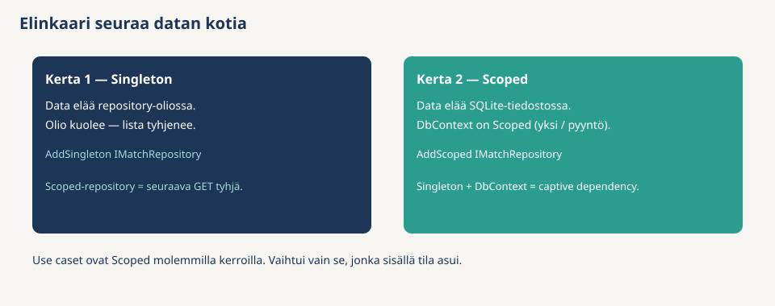

### Checkpoint

`LeagueHub.Api` näyttää tältä. Älä aja vielä Swaggeria — migraatiot puuttuvat.

```
LeagueHub.Api/
├── Controllers/
│   ├── TeamsController.cs
│   ├── PlayersController.cs
│   └── MatchesController.cs
├── Requests/
│   ├── CreateTeamRequest.cs
│   ├── CreateMatchRequest.cs
│   ├── RecordResultRequest.cs
│   └── AddPlayerRequest.cs
├── Program.cs
└── appsettings.json
```

</details>

---

<details>
<summary>Ohjattu osio 10 — Migraatiot ja ensimmäinen ajo</summary>

**Miksi tämä osio?** Tietokannassa ei vielä ole tauluja. EF ei luo niitä itsestään — sille pitää antaa ohje siitä, miltä taulut näyttävät. Se ohje on **migraatio**: C#-tiedosto, joka kuvaa taulut ja sarakkeet. Kun ohjelma käynnistyy, seederin `MigrateAsync` (osio 8) ajaa migraatiot ja taulut syntyvät.

### 1. Asenna työkalut

```bash
dotnet tool install --global dotnet-ef
dotnet add LeagueHub.Api package Microsoft.EntityFrameworkCore.Design
```

`dotnet-ef` on komentorivityökalu, joka kirjoittaa migraatiotiedostot puolestasi. Design-paketti tarvitaan, jotta työkalu voi käynnistää projektin. Jos `dotnet-ef` on jo asennettu, install valittaa — se on ok.

### 2. Luo migraatio

```bash
dotnet ef migrations add InitialCreate --project LeagueHub.Infrastructure --startup-project LeagueHub.Api --context LeagueHubDbContext
```

Komennossa on kaksi projektia, koska niillä on eri roolit:

- `--project LeagueHub.Infrastructure` — migraatiotiedostot syntyvät tänne, koska `DbContext` on täällä. Domain ja Application pysyvät puhtaina EF:stä.
- `--startup-project LeagueHub.Api` — työkalu käynnistää tämän projektin, koska yhteysmerkkijono luetaan API:n `appsettings.json`ista.

Avaa syntynyt `Migrations/*_InitialCreate.cs` ja silmäile sitä: sieltä löytyvät taulut `Teams`, `Players` ja `Matches` — samat asiat, jotka kerroit `OnModelCreating`issa.

### 3. Pidä tietokantatiedosto poissa gitistä

Lisää `.gitignore`-tiedostoon rivit `*.db`, `*.db-shm` ja `*.db-wal`. `leaguehub.db` on ajon dataa, ei lähdekoodia — jokainen kone luo omansa, kun ohjelma käynnistyy.

### 4. Käynnistä ja kokeile

```bash
dotnet run --project LeagueHub.Api
```

Ensimmäisellä käynnistyksellä `MigrateAsync` luo taulut ja seeder täyttää alkudatan. Aja Swaggerissa tämä sarja järjestyksessä:

1. `GET /api/teams` → kolme seed-joukkuetta
2. `POST /api/teams/1/players` bodylla `{ "name": "Ville Vitonen", "number": 5 }` → 201
3. Sama numero samaan joukkueeseen uudestaan → 400 (numero varattu — sääntö tuli use casesta)
4. `POST /api/matches/1/result` bodylla `{ "homeGoals": 5, "awayGoals": 2 }` → 200
5. Sama uudestaan → 400 (tulos vain kerran — sääntö tuli `Match.RecordResult`ista)
6. `GET /api/standings` → kotijoukkueella 3 pistettä
7. Sammuta ohjelma ja käynnistä uudelleen — tulos ja pelaajat ovat yhä tallessa. Kerralla 1 ne katosivat, koska data eli muistissa.

### Checkpoint

Infrastructureen on tullut `Migrations/`-kansio. `.db`-tiedostot eivät mene gitiin.

```
LeagueHub.Infrastructure/
├── Migrations/
│   ├── *_InitialCreate.cs
│   ├── *_InitialCreate.Designer.cs
│   └── LeagueHubDbContextModelSnapshot.cs
├── Persistence/
│   ├── LeagueHubDbContext.cs
│   └── DbSeeder.cs
└── Repositories/
    ├── TeamRepository.cs
    ├── PlayerRepository.cs
    └── MatchRepository.cs
```

</details>

---

<details>
<summary>Ohjattu osio 11 — Testit</summary>

**Miksi tämä osio?** Säännöt kirjoitettiin entiteetteihin ja use caseihin — nyt todistetaan testeillä, että ne pitävät. Testejä on kaksi tasoa, ja domain-taso on *helpompi*:

1. **Domain-testit** — luo olio ja kutsu metodia. Ei fakea, ei HTTP:tä, ei tietokantaa. `Match.RecordResult` on tavallinen metodi, jota testi kutsuu suoraan.
2. **Use case -testit** — use case tarvitsee repositoryn. Testi antaa **faken**: luokan, joka toteuttaa saman rajapinnan kuin EF-versio mutta pitää oliot tavallisessa listassa muistissa.

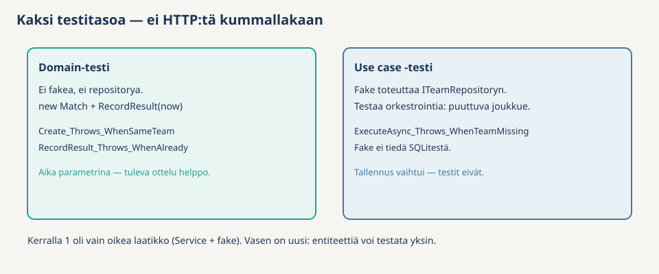

Miksi kaksi tasoa? Sääntö testataan siellä, missä se asuu. "Tulos vain kerran" on `Match`issa → domain-testi. "Numero uniikki joukkueessa" tarkistetaan use casessa, koska yksittäinen `Player` ei näe joukkueen muita pelaajia → use case -testi.

Yksi valmistelu ennen testejä: `AssignId` on Domainissa `internal`, eli vain saman projektin koodi näkee sen. Fake-repositoryn pitää silti antaa olioille id (oikeassa ajossa sen tekee tietokanta). Avaa siis Domainin `LeagueHub.Domain.csproj` ja lisää:

```xml
<ItemGroup>
  <InternalsVisibleTo Include="LeagueHub.Tests" />
</ItemGroup>
```

Rivi tarkoittaa: `LeagueHub.Tests`-projekti saa käyttää Domainin `internal`-jäseniä. Muut projektit eivät.

### Domain-testit

**1. `LeagueHub.Tests/Domain/MatchTests.cs`** — kutsuu `Match.Create` ja `RecordResult` suoraan. Fakea ei tarvita. `now`-parametri on sama idea kuin osiossa 6: testi “ennen ottelua” antaa kellonajan, joka on ennen `ScheduledAt`.

```csharp
using LeagueHub.Domain.Entities;
using LeagueHub.Domain.Exceptions;
using LeagueHub.Domain.ValueObjects;

namespace LeagueHub.Tests.Domain;

public class MatchTests
{
    [Fact]
    public void Create_Throws_WhenHomeAndAwayAreTheSameTeam()
    {
        Assert.Throws<DomainException>(() =>
            Match.Create(homeTeamId: 1, awayTeamId: 1, scheduledAt: DateTime.UtcNow));
    }

    [Fact]
    public void RecordResult_Throws_WhenResultAlreadyExists()
    {
        Match match = Match.Create(1, 2, DateTime.UtcNow.AddDays(-1));
        Score score = Score.Create(1, 0);
        match.RecordResult(score, DateTime.UtcNow);

        Assert.Throws<DomainException>(() =>
            match.RecordResult(Score.Create(2, 2), DateTime.UtcNow));
    }

    [Fact]
    public void RecordResult_Throws_WhenMatchHasNotBeenPlayed()
    {
        DateTime kickoff = DateTime.UtcNow.AddDays(3);
        Match match = Match.Create(1, 2, kickoff);
        DateTime beforeKickoff = kickoff.AddHours(-1);

        Assert.Throws<DomainException>(() =>
            match.RecordResult(Score.Create(1, 0), beforeKickoff));
    }

    [Fact]
    public void RecordResult_SetsGoals_WhenMatchIsInThePast()
    {
        Match match = Match.Create(1, 2, DateTime.UtcNow.AddDays(-1));

        match.RecordResult(Score.Create(5, 2), DateTime.UtcNow);

        Assert.Equal(5, match.HomeGoals);
        Assert.Equal(2, match.AwayGoals);
    }
}
```

**2. `Domain/TeamTests.cs`** — samat säännöt, jotka `Team.Create` ja `EnsureCanAddPlayer` suojaavat: nimi ei tyhjä, `maxRoster` positiivinen, täyteen rosteriin ei mahdu.

```csharp
using LeagueHub.Domain.Entities;
using LeagueHub.Domain.Exceptions;

namespace LeagueHub.Tests.Domain;

public class TeamTests
{
    [Fact]
    public void Create_Throws_WhenNameIsEmpty()
    {
        Assert.Throws<DomainException>(() => Team.Create("", "Mikkeli", 10));
    }

    [Fact]
    public void Create_Throws_WhenNameIsWhitespace()
    {
        Assert.Throws<DomainException>(() => Team.Create("   ", "Mikkeli", 10));
    }

    [Fact]
    public void Create_Throws_WhenMaxRosterIsZeroOrNegative()
    {
        Assert.Throws<DomainException>(() => Team.Create("Maila", "Mikkeli", 0));
        Assert.Throws<DomainException>(() => Team.Create("Maila", "Mikkeli", -3));
    }

    [Fact]
    public void Create_TrimsNameAndCity()
    {
        Team team = Team.Create("  Maila  ", "  Mikkeli  ", 10);

        Assert.Equal("Maila", team.Name);
        Assert.Equal("Mikkeli", team.City);
    }

    [Fact]
    public void EnsureCanAddPlayer_Throws_WhenRosterIsFull()
    {
        Team team = Team.Create("Maila", "Mikkeli", 2);

        Assert.Throws<DomainException>(() => team.EnsureCanAddPlayer(2));
    }

    [Fact]
    public void EnsureCanAddPlayer_DoesNotThrow_WhenRosterHasRoom()
    {
        Team team = Team.Create("Maila", "Mikkeli", 2);

        team.EnsureCanAddPlayer(1);
    }
}
```

**3. `Domain/PlayerTests.cs`** — nimi ei tyhjä, numero positiivinen. Huomaa, mitä täältä *puuttuu*: numeron uniikkiutta ei voi testata täällä, koska yksittäinen pelaaja ei näe joukkuetovereitaan. Se testataan use case -testissä.

```csharp
using LeagueHub.Domain.Entities;
using LeagueHub.Domain.Exceptions;

namespace LeagueHub.Tests.Domain;

public class PlayerTests
{
    [Fact]
    public void Create_Throws_WhenNameIsEmpty()
    {
        Assert.Throws<DomainException>(() => Player.Create(1, "", 10));
    }

    [Fact]
    public void Create_Throws_WhenNumberIsZeroOrNegative()
    {
        Assert.Throws<DomainException>(() => Player.Create(1, "Pekka", 0));
        Assert.Throws<DomainException>(() => Player.Create(1, "Pekka", -7));
    }

    [Fact]
    public void Create_ReturnsPlayer_WhenValid()
    {
        Player player = Player.Create(1, "  Pekka  ", 10);

        Assert.Equal("Pekka", player.Name);
        Assert.Equal(10, player.Number);
        Assert.Equal(1, player.TeamId);
    }
}
```

**4. `Domain/ScoreTests.cs`** — value objectin ainoa sääntö: maalit eivät ole negatiivisia.

```csharp
using LeagueHub.Domain.Exceptions;
using LeagueHub.Domain.ValueObjects;

namespace LeagueHub.Tests.Domain;

public class ScoreTests
{
    [Fact]
    public void Create_Throws_WhenHomeGoalsAreNegative()
    {
        Assert.Throws<DomainException>(() => Score.Create(-1, 0));
    }

    [Fact]
    public void Create_Throws_WhenAwayGoalsAreNegative()
    {
        Assert.Throws<DomainException>(() => Score.Create(0, -1));
    }

    [Fact]
    public void Create_ReturnsScore_WhenGoalsAreValid()
    {
        var score = Score.Create(5, 2);

        Assert.Equal(5, score.HomeGoals);
        Assert.Equal(2, score.AwayGoals);
    }
}
```

### Fake-repositoryt

Luo kansio `Fakes/`. Use case ei tiedä EF:stä — se tuntee vain rajapinnan. Siksi testiin kelpaa toteutus, joka pitää oliot tavallisessa listassa. `AssignId` täyttää id:n, koska tietokantaa ei ole antamassa sitä.

**`Fakes/FakeTeamRepository.cs`:**

```csharp
using LeagueHub.Domain.Entities;
using LeagueHub.Domain.Interfaces;

namespace LeagueHub.Tests.Fakes;

public class FakeTeamRepository : ITeamRepository
{
    public List<Team> Teams { get; } = new();
    private int _nextId = 1;

    public Task<List<Team>> GetAllAsync() => Task.FromResult(Teams.ToList());

    public Task<Team?> GetByIdAsync(int id) =>
        Task.FromResult(Teams.FirstOrDefault(t => t.Id == id));

    public Task<Team> AddAsync(Team team)
    {
        team.AssignId(_nextId++);
        Teams.Add(team);
        return Task.FromResult(team);
    }
}
```

**`Fakes/FakeMatchRepository.cs`** — `UpdateAsync` on pelkkä `Task.CompletedTask`: olio on jo listassa ja `RecordResult` muutti sen tilaa, joten tallennettavaa ei ole. Sama syy kuin EF-versiossa, jossa riitti `SaveChangesAsync`.

```csharp
using LeagueHub.Domain.Entities;
using LeagueHub.Domain.Interfaces;

namespace LeagueHub.Tests.Fakes;

public class FakeMatchRepository : IMatchRepository
{
    public List<Match> Matches { get; } = new();
    private int _nextId = 1;

    public Task<List<Match>> GetAllAsync() => Task.FromResult(Matches.ToList());

    public Task<Match?> GetByIdAsync(int id) =>
        Task.FromResult(Matches.FirstOrDefault(m => m.Id == id));

    public Task<Match> AddAsync(Match match)
    {
        match.AssignId(_nextId++);
        Matches.Add(match);
        return Task.FromResult(match);
    }

    public Task UpdateAsync(Match match) => Task.CompletedTask;
}
```

**`Fakes/FakePlayerRepository.cs`** — sama kaava, rajapinnassa on vain kaksi metodia:

```csharp
using LeagueHub.Domain.Entities;
using LeagueHub.Domain.Interfaces;

namespace LeagueHub.Tests.Fakes;

public class FakePlayerRepository : IPlayerRepository
{
    public List<Player> Players { get; } = new();
    private int _nextId = 1;

    public Task<List<Player>> GetByTeamIdAsync(int teamId) =>
        Task.FromResult(Players.Where(p => p.TeamId == teamId).ToList());

    public Task<Player> AddAsync(Player player)
    {
        player.AssignId(_nextId++);
        Players.Add(player);
        return Task.FromResult(player);
    }
}
```

### Use case -testit

**1. `UseCases/CreateMatchUseCaseTests.cs`** — testi antaa faket konstruktorissa. Ensimmäinen testi: toista joukkuetta ei ole → `NotFoundException`. Toinen: sama joukkue koti ja vieras → `DomainException`. Huomaa, että jälkimmäisen säännön heittää Domain (`Match.Create`) — use case ei tarkista sitä itse, testi vain todistaa, että poikkeus kulkee läpi.

```csharp
using LeagueHub.Application.Exceptions;
using LeagueHub.Application.UseCases.Matches;
using LeagueHub.Domain.Entities;
using LeagueHub.Domain.Exceptions;
using LeagueHub.Tests.Fakes;

namespace LeagueHub.Tests.UseCases;

public class CreateMatchUseCaseTests
{
    private readonly FakeTeamRepository _teams = new();
    private readonly FakeMatchRepository _matches = new();
    private readonly CreateMatchUseCase _useCase;

    public CreateMatchUseCaseTests()
    {
        _useCase = new CreateMatchUseCase(_teams, _matches);
    }

    [Fact]
    public async Task ExecuteAsync_Throws_WhenTeamIsMissing()
    {
        Team home = await _teams.AddAsync(Team.Create("A", "X", 10));

        await Assert.ThrowsAsync<NotFoundException>(() =>
            _useCase.ExecuteAsync(home.Id, awayTeamId: 999, DateTime.UtcNow.AddDays(1)));
    }

    [Fact]
    public async Task ExecuteAsync_Throws_WhenHomeAndAwayAreTheSame()
    {
        Team team = await _teams.AddAsync(Team.Create("A", "X", 10));

        await Assert.ThrowsAsync<DomainException>(() =>
            _useCase.ExecuteAsync(team.Id, team.Id, DateTime.UtcNow.AddDays(1)));
    }
}
```

**2. `UseCases/RecordMatchResultUseCaseTests.cs`** — puuttuva ottelu → 404-poikkeus, tuleva ottelu ja negatiiviset maalit → sääntöpoikkeus, onnistunut kirjaus → maalit tallessa.

```csharp
using LeagueHub.Application.Exceptions;
using LeagueHub.Application.UseCases.Matches;
using LeagueHub.Domain.Entities;
using LeagueHub.Domain.Exceptions;
using LeagueHub.Tests.Fakes;

namespace LeagueHub.Tests.UseCases;

public class RecordMatchResultUseCaseTests
{
    private readonly FakeMatchRepository _matches = new();
    private readonly RecordMatchResultUseCase _useCase;

    public RecordMatchResultUseCaseTests()
    {
        _useCase = new RecordMatchResultUseCase(_matches);
    }

    [Fact]
    public async Task ExecuteAsync_Throws_WhenMatchIsMissing()
    {
        await Assert.ThrowsAsync<NotFoundException>(() =>
            _useCase.ExecuteAsync(matchId: 999, homeGoals: 1, awayGoals: 0));
    }

    [Fact]
    public async Task ExecuteAsync_Throws_WhenMatchIsInTheFuture()
    {
        Match match = await _matches.AddAsync(
            Match.Create(1, 2, DateTime.UtcNow.AddDays(3)));

        await Assert.ThrowsAsync<DomainException>(() =>
            _useCase.ExecuteAsync(match.Id, 1, 0));
    }

    [Fact]
    public async Task ExecuteAsync_Throws_WhenGoalsAreNegative()
    {
        Match match = await _matches.AddAsync(
            Match.Create(1, 2, DateTime.UtcNow.AddDays(-1)));

        await Assert.ThrowsAsync<DomainException>(() =>
            _useCase.ExecuteAsync(match.Id, -1, 0));
    }

    [Fact]
    public async Task ExecuteAsync_RecordsResult_WhenMatchIsPlayed()
    {
        Match match = await _matches.AddAsync(
            Match.Create(1, 2, DateTime.UtcNow.AddDays(-1)));

        Match updated = await _useCase.ExecuteAsync(match.Id, 5, 2);

        Assert.Equal(5, updated.HomeGoals);
        Assert.Equal(2, updated.AwayGoals);
    }
}
```

**3. `UseCases/AddPlayerToTeamUseCaseTests.cs`** — tässä testataan se uniikkiussääntö, joka ei mahtunut `PlayerTestsiin`: kaksi pelaajaa, sama numero, sama joukkue → poikkeus.

```csharp
using LeagueHub.Application.Exceptions;
using LeagueHub.Application.UseCases.Players;
using LeagueHub.Domain.Entities;
using LeagueHub.Domain.Exceptions;
using LeagueHub.Tests.Fakes;

namespace LeagueHub.Tests.UseCases;

public class AddPlayerToTeamUseCaseTests
{
    private readonly FakeTeamRepository _teams = new();
    private readonly FakePlayerRepository _players = new();
    private readonly AddPlayerToTeamUseCase _useCase;

    public AddPlayerToTeamUseCaseTests()
    {
        _useCase = new AddPlayerToTeamUseCase(_teams, _players);
    }

    [Fact]
    public async Task ExecuteAsync_Throws_WhenTeamIsMissing()
    {
        await Assert.ThrowsAsync<NotFoundException>(() =>
            _useCase.ExecuteAsync(teamId: 999, "Pekka", 10));
    }

    [Fact]
    public async Task ExecuteAsync_Throws_WhenNumberIsTaken()
    {
        Team team = await _teams.AddAsync(Team.Create("A", "X", 10));
        await _useCase.ExecuteAsync(team.Id, "Pekka", 10);

        await Assert.ThrowsAsync<DomainException>(() =>
            _useCase.ExecuteAsync(team.Id, "Maija", 10));
    }

    [Fact]
    public async Task ExecuteAsync_Throws_WhenRosterIsFull()
    {
        Team team = await _teams.AddAsync(Team.Create("A", "X", 1));
        await _useCase.ExecuteAsync(team.Id, "Pekka", 10);

        await Assert.ThrowsAsync<DomainException>(() =>
            _useCase.ExecuteAsync(team.Id, "Maija", 11));
    }

    [Fact]
    public async Task ExecuteAsync_AddsPlayer_WhenValid()
    {
        Team team = await _teams.AddAsync(Team.Create("A", "X", 10));

        Player player = await _useCase.ExecuteAsync(team.Id, "Pekka", 10);

        Assert.Single(_players.Players);
        Assert.Equal(team.Id, player.TeamId);
    }
}
```

### Aja testit

```bash
dotnet test LeagueHub.Clean.sln
```

Kaikkien testien pitää mennä läpi.

### Checkpoint

`LeagueHub.Tests` näyttää tältä:

```
LeagueHub.Tests/
├── Domain/
│   ├── MatchTests.cs
│   ├── TeamTests.cs
│   ├── PlayerTests.cs
│   └── ScoreTests.cs
├── Fakes/
│   ├── FakeTeamRepository.cs
│   ├── FakePlayerRepository.cs
│   └── FakeMatchRepository.cs
└── UseCases/
    ├── CreateMatchUseCaseTests.cs
    ├── RecordMatchResultUseCaseTests.cs
    └── AddPlayerToTeamUseCaseTests.cs
```

</details>

---

<details>
<summary>Ohjattu osio 12 — Kääntäjä valvoo Dependency Rulea</summary>

**Miksi tämä osio?** Osiossa 5 väitettiin, että kääntäjä valvoo arkkitehtuuria. Nyt todistat sen kolmella pienellä kokeella. Kokeet rikkovat sääntöjä tahallaan — juuri siksi näet, että rikkomus ei mene läpi.

**Koe 1: väärä `using`.** Lisää `Match.cs`:ään rivi `using LeagueHub.Infrastructure.Persistence;` ja käännä. Tulee käännösvirhe: Domain-projektilla ei ole viittausta Infrastructureen, joten se ei näe sen nimiavaruuksia. Kerralla 1 vastaava rivi olisi kääntynyt, koska kaikki oli samassa projektissa.

**Koe 2: viittaus väärään suuntaan.**

```bash
dotnet add LeagueHub.Domain reference LeagueHub.Api
```

Komento epäonnistuu. Viittaus loisi kehän (Domain → Api → Application → Domain), ja `dotnet` kieltäytyy lisäämästä sitä. Dependency Rule ei siis ole pelkkä sopimus paperilla — työkalut estävät väärän suunnan.

**Koe 3: Domainin viittaukset.** Aja `dotnet list LeagueHub.Domain reference`. Lista on tyhjä — Domain ei riipu mistään.

Poista lopuksi kokeen 1 `using`-rivi, jotta solution kääntyy taas.

### Kansiorakenne nyt


```
LeagueHub.Clean.sln
├── LeagueHub.Domain/
│   ├── Entities/Team.cs, Player.cs, Match.cs
│   ├── ValueObjects/Score.cs
│   ├── Exceptions/DomainException.cs
│   └── Interfaces/ITeamRepository.cs, IPlayerRepository.cs, IMatchRepository.cs
├── LeagueHub.Application/
│   ├── Exceptions/NotFoundException.cs
│   ├── Models/Standing.cs
│   └── UseCases/Teams/ …  UseCases/Players/ …  UseCases/Matches/ …
├── LeagueHub.Infrastructure/
│   ├── Migrations/
│   ├── Persistence/LeagueHubDbContext.cs, DbSeeder.cs
│   └── Repositories/
├── LeagueHub.Api/
│   ├── Controllers/
│   ├── Requests/
│   └── Program.cs
└── LeagueHub.Tests/
    ├── Domain/
    ├── Fakes/
    └── UseCases/
```

Domain- ja Application-projekteissa ei ole riviä EF:ää, HTTP:tä eikä SQLiteä.

</details>

---

# Peilaus kertaan 1

Sovellus on valmis. Nyt avaa kerran 1 kerrosversio rinnalle — tämä vertailu tehdään vasta nyt, koska sinulla on oma rikas `Match`.

<details>
<summary>Ohjattu osio 13 — Mitä Clean Architecture ratkaisi</summary>

**Miksi tämä osio?** Rakensit saman tuotteen kahdesti: kerralla 1 kerrosarkkitehtuurilla, nyt Clean Architecturella. Ero ei ole mielipide, vaan se näkyy koodista. Tässä osiossa katsot molemmat rinnakkain.

Avaa kerran 1 `MatchService.RecordResult` ja `Models/Match.cs` vierekkäin oman `Match.cs`:si kanssa.

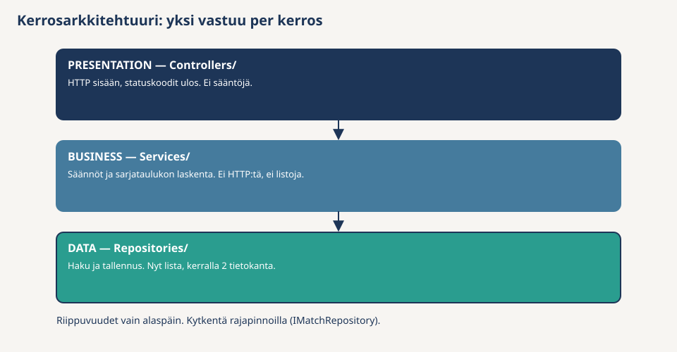

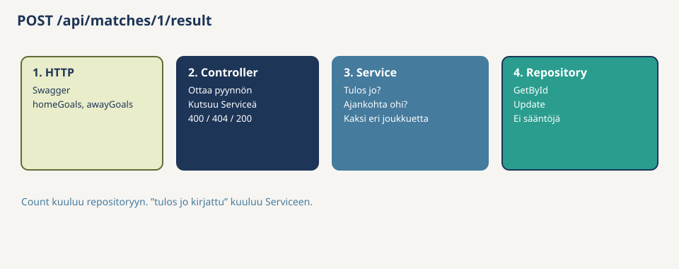

### Kolme heikkoutta, jotka juuri korjasit

**1. Kerrokset olivat kansioita.** Uusi rivi controllerissa saattoi kutsua repositorya suoraan, ja projekti kääntyi. Sinun versiossasi kerrokset ovat **projekteja** — kokeilit osiossa 12, että väärä `using` ei käänny.

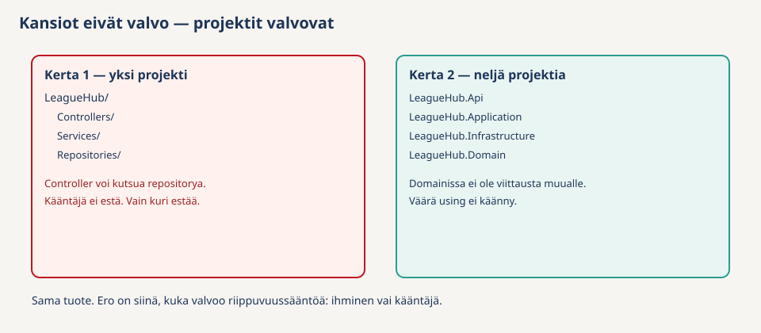

**2. Säännöt asuivat väärässä paikassa.** Kerran 1 `Match`:

```csharp
public class Match
{
    public int Id { get; set; }
    public int HomeTeamId { get; set; }
    public int AwayTeamId { get; set; }
    public DateTime ScheduledAt { get; set; }
    public int? HomeGoals { get; set; }
    public int? AwayGoals { get; set; }
}
```

Tämä on **aneeminen malli**: tietosäiliö ilman käyttäytymistä. `new Match { HomeGoals = -1 }` kääntyy. Sääntö ja data ovat eri tiedostoissa.

Sinun `Match`-luokassasi on `private set`, factory ja `RecordResult` — **rikas malli**.

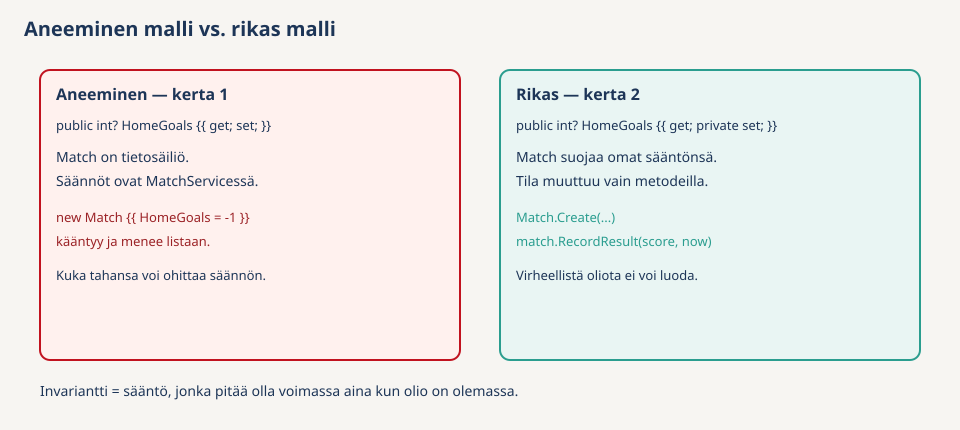

**3. "Data oli pohjalla."** Kerrosarkkitehtuurissa Business kutsuu Dataa. Sinulla domain on keskellä; `dotnet list LeagueHub.Domain reference` on tyhjä.

### Muuttokartta

| Kerralla 1 | Kerralla 2 (sinun koodisi) | Mitä siirto ratkaisee |
|------------|----------------------------|------------------------|
| Aneeminen `Match`, julkiset setterit | Rikas `Create` + `RecordResult` | `HomeGoals = -1` ei käänny |
| Neljä `if`:ää `MatchServicessä` | Invariantit entiteettiin, "ei löydy" use caseen | Sääntö kulkee olion mukana |
| Rajapinta ja toteutus samassa projektissa | Rajapinta Domainissa, EF Infrassa | Tietokanta riippuu domainista |
| Kerrokset kansioina | Kerrokset projekteina | Väärä `using` on käännösvirhe |
| Listat muistissa, Singleton-repositoryt | SQLite, Scoped | Sammutus ei tyhjennä dataa; ei captive dependencyä |

Kerralla 1 in-memory-repositoryn *piti* olla Singleton. Nyt Scoped:

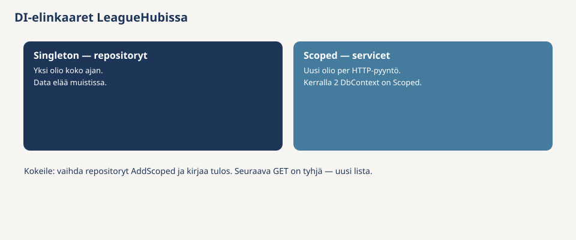

Kerralla 1 sääntötesti vaati aina faken, koska sääntö asui servicessä repositoryn takana. Sinun `MatchTests`-luokkasi ei tarvitse yhtään rajapintaa:

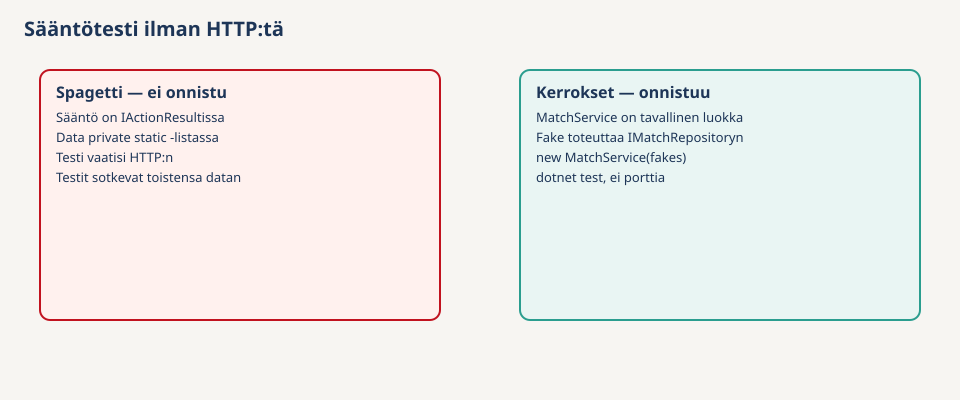

### Checkpoint

1. Missä kerran 1 tiedostossa on `if (match.HomeGoals is not null)`? Missä se on sinulla?
2. Kääntyykö kerran 1 projektissa `new Match { HomeTeamId = 1, AwayTeamId = 1 }`? Entä Domainissasi?
3. Estäisikö kääntäjä kerran 1 controlleria asettamasta `HomeGoals`-kenttää? Entä sinulla?

Älä muuta kerran 1 koodia — se on todistusaineistoa. Vanhan `LeagueHub/`-projektin voi jättää viereiseen kansioon tai poistaa myöhemmin, kun uusi API on testattu.

</details>

---

# Soveltava osio

Ohjatussa osiossa kuljit ketjun domainista API:in valmiin ohjeen kanssa. Nyt lisäät **yhden uuden ominaisuuden** itse, samalla ketjulla mutta ilman valmista koodia. Yritä ensin — avaa vinkki vasta, jos olet jumissa.

<details>
<summary>Soveltava — Pelaajan siirto toiseen joukkueeseen</summary>

**Miksi tämä osio?** Ohjatussa näit, minne `Player` ja `AddPlayerToTeamUseCase` kuuluvat. Nyt toistat saman ketjun *uudelle* ominaisuudelle ilman mallia.

Asiakas:

> Pelaaja pitää voida siirtää toiseen joukkueeseen kesken kauden. Kohdejoukkueen rosterissa pitää olla tilaa, eikä pelaajan numero saa olla varattu kohteessa.

| Metodi | Reitti | Statuskoodit |
|--------|--------|--------------|
| POST | `api/players/{id}/transfer` (body: `targetTeamId`) | 200 / 404 / 400 |

**Hyväksymiskriteerit:**

- Päätä ensin osion 4 nyrkkisäännöllä, mihin kerrokseen kukin sääntö kuuluu — kirjoita koodi vasta sitten
- Domainiin metodi, joka vaihtaa `TeamId`:n — ei julkista setteriä
- Controller pysyy ohuena
- Vähintään yksi domain-testi ja yksi use case -testi
- Kirjaa ylös: mikä sääntö meni entiteettiin, mikä use caseen — ja miksi

Toteuta järjestyksessä: domain → rajapinta tarvittaessa → use case → EF-toteutus → request + controller + DI → testit.

<details>
<summary>Jos jumissa — sijoitus</summary>

- Pelaaja ja kohdejoukkue ovat olemassa → use case (`NotFoundException` → 404)
- Siirto samaan joukkueeseen ei ole siirto → domain (`Player.TransferTo` heittää, jos `TeamId` on sama)
- Kohteen roster ei ylity → `Team.EnsureCanAddPlayer(kohteenRosterinKoko)` — sama metodi kuin ohjatussa
- Numero uniikki kohteessa → use case (vaatii kohteen pelaajat)

</details>

<details>
<summary>Jos jumissa — mitä tiedostoihin</summary>

- `IPlayerRepositoryyn` `GetByIdAsync` ja `UpdateAsync` — rajapintaan ja `PlayerRepositoryyn`
- `TransferPlayerUseCase` Applicationissa; request-malli APIssa (`targetTeamId`)
- Reitti voi olla omassa `PlayersControllerissa` polulla `api/players/{id}/transfer` tai laajennuksena nykyiseen
- Domain-testi: siirto samaan joukkueeseen → `DomainException`
- Use case -testi: numero varattu kohteessa → `DomainException`

</details>

</details>

---

<details>
<summary>Muistilista välitehtävään</summary>

[Välitehtävässä](../../Valitehtava.md) sinun pitää osata tästä tehtävästä:

- [ ] Nimetä neljä kerrosta ja Dependency Rule omin sanoin
- [ ] Näyttää, että Domainilla ei ole projektiviittauksia
- [ ] Ero aneemisen ja rikkaan mallin välillä — oma `Match` vastaan kerran 1 `Match` (osio 13)
- [ ] Miksi "tulos vain kerran" on entiteetissä ja "joukkueet ovat olemassa" use casessa
- [ ] Miksi pelinumeron positiivisuus on `Player.Createssa`, mutta uniikkius `AddPlayerToTeamUseCasessa`
- [ ] Miksi repository-rajapinta on Domainissa
- [ ] Miksi repositoryt ovat Scoped
- [ ] Näyttää domain-testi ilman fakea
- [ ] Esitellä soveltava (pelaajasiirto)

Käy [kertauskysymykset](../kertauskysymykset.md).

</details>

---

<details>
<summary>Yhteenveto — mitä opimme?</summary>

| Käsite | Mitä opit |
|--------|-----------|
| DDD | Entiteetti, invariantti, VO, use case — nimet osion 3 tuotteelle |
| Säännön paikka | Yhden olion data → entiteetti; haku / useita olioita → use case |
| Value object | `Score` on VO; pelinumero jäi `int`:iksi |
| Clean Architecture | Neljä projektia; Dependency Rule; composition root |
| Use case | Orkestroi — `AddPlayerToTeamUseCase` näyttää tasot |
| EF Core CA:ssa | Vain Infrastructure; rajapinta Domainissa |
| Testit | Domain ilman fakea; use case fake-rajapinnalla |
| Peilaus | Kansiot eivät valvo; aneeminen malli; data "pohjalla" |

</details>

---

<details>
<summary>Ennen kuin siirryt eteenpäin</summary>

Viikkotehtävää **ei palauteta Moodleen**. Kokonaisuus näytetään [välitehtävässä](../../Valitehtava.md).

- [ ] Neljä projektia, Domainilla ei viittauksia
- [ ] Osion 10 esimerkkiajo toimii, myös restartin jälkeen
- [ ] Domain- ja use case -testit menevät läpi
- [ ] Peilaus tehty
- [ ] Pelaajasiirto tehty domainista kaikkiin kerroksiin

**Tuki**

1. Lue käännösvirhe — usein väärä projektiviittaus tai puuttuva `using`
2. Onko sääntö entiteetissä vai controllerissa?
3. Domain ei käänny, jos sinne lipsahti `Microsoft.EntityFrameworkCore`
4. 500 Swaggerissa: poikkeus ei ole `DomainException` / `NotFoundException`
5. Testi ei löydä `AssignId`: `InternalsVisibleTo` Domainin csprojissa

Valmis, kommentoitu malliohjelma (myös pelaajasiirto) on kansiossa [examples/Assignment-1/clean-v2](../examples/Assignment-1/clean-v2/). Avaa se vasta, kun olet yrittänyt.

Seuraavaksi: **[Assignment 2](../Assignment-2/README.md)** — Lainaamo tyhjästä. Kerralla 3: Output-DTO:t, Result Pattern, paginaatio.

</details>
