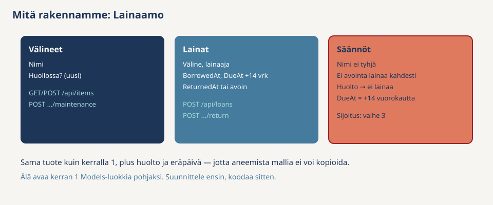
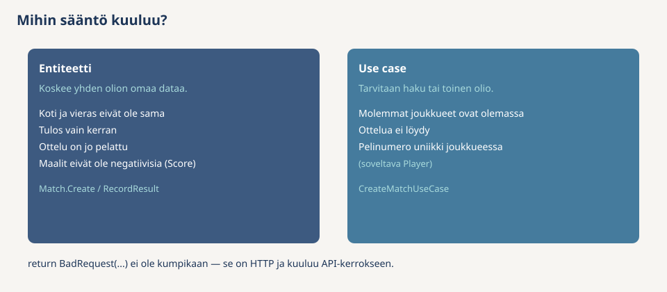
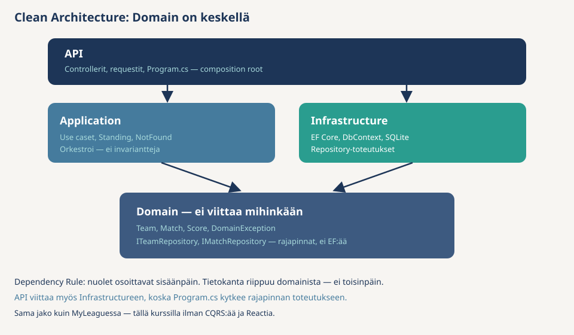

# Assignment 2 v2: Lainaamo — suunnittele arkkitehtuuri

*Luonnos uudesta versiosta. Nykyinen tehtävä on [README.md](README.md).*

[Assignment 1:ssä](../Assignment-1/README-v2.md) rakensit LeagueHubin valmiin ohjeen kanssa. Tässä tehtävässä **ei kirjoiteta koodia**. Harjoittelet sen sijaan työn, joka tehdään ennen ensimmäistäkään koodiriviä: tunnistat asiakkaan käsitteet ja säännöt, päätät säännöille paikan ja suunnittelet projektirakenteen.

Tämä on täsmälleen se taito, jota [välitehtävässä](../../Valitehtava.md) kysytään: *osaatko sijoittaa säännön ja perustella paikan*. Koodin kirjoittaminen mallin mukaan on helppoa — päätökset sitä ennen ovat se vaikea osa.

**Mitä palautat itsellesi:** yksi tiedosto (esim. `lainaamo-suunnitelma.md`) tai paperi, jossa on neljän tehtävän tuotokset. Tätä ei palauteta Moodleen, mutta pidä se tallessa — suunnitelmaan palataan, jos toteutat Lainaamon myöhemmin.

**Pelisäännöt:**

- Tee tehtävät järjestyksessä. Jokaisen tehtävän mallivastaus on piilossa — avaa se vasta, kun oma versiosi on valmis.
- Erot omaan versioon eivät ole automaattisesti virheitä. Mutta jokainen ero pitää pystyä perustelemaan.
- Koottu mallivastaus on tiedostossa [examples/Assignment-2/suunnitelma-v2.md](../examples/Assignment-2/suunnitelma-v2.md). Avaa se vasta, kun omat neljä tehtävää on tehty.

---

<details>
<summary>Toimeksianto — lue tämä ensin</summary>

Asiakas on kampuksen liikuntavastaava. Hän kertoo:

> Meillä on kampuksella välinehuone. Hyllyssä on lainattavia välineitä: palloja, mailoja, heijastinliivejä. Henkilökunta lisää uusia välineitä järjestelmään ja lainaa niitä opiskelijoille. Kun opiskelija tuo välineen takaisin, laina merkitään päättyneeksi.
>
> Laina on aina kaksi viikkoa — eräpäivä lasketaan lainaushetkestä. Välineitä menee joskus rikki, ja silloin väline laitetaan huoltoon. Huollossa olevaa välinettä ei saa lainata. Samaa välinettä ei tietenkään voi lainata kahdelle opiskelijalle yhtä aikaa. Ja kun laina on kerran merkitty palautetuksi, sitä ei voi palauttaa uudestaan.
>
> Välineellä pitää aina olla nimi, ja lainaan pitää aina kirjata lainaajan nimi. Haluamme myös nähdä listan välineistä ja listan lainoista.

Muuta materiaalia ei ole. Kaikki tehtävät tehdään tämän tekstin pohjalta — samalla tavalla kuin Assignment 1:n osiossa 3 tehtiin LeagueHubille.

</details>

---

<details>
<summary>Tehtävä 1 — Tunnista käsitteet, tekemiset ja säännöt</summary>

**Miksi tämä tehtävä?** Ohjelman rakenne seuraa asiakkaan maailmaa, ei tietokantaa. Siksi ensimmäinen työ on lukea toimeksianto ja poimia siitä kolme listaa — asiakkaan omilla sanoilla, ilman teknisiä termejä.

### 1a. Kolme listaa

Kirjoita suunnitelmatiedostoosi:

1. **Käsitteet** — mitkä *asiat* toimeksiannossa esiintyvät? (LeagueHubissa: joukkue, pelaaja, ottelu, tulos…)
2. **Tekemiset** — mitä järjestelmällä *tehdään*? Yksi tekeminen per rivi, verbillä alkaen. (LeagueHubissa: perusta joukkue, kirjaa tulos…)
3. **Säännöt** — mitkä lauseet rajoittavat sitä, mikä on sallittua? Asiakkaan suusta, ei koodista. (LeagueHubissa: "tuloksen saa kirjata vain kerran".)

Älä vielä mieti luokkia, tauluja tai reittejä. Vain asiakkaan sanat.

### 1b. DDD-nimet käsitteille

Käy käsitelistasi läpi Assignment 1:n osion 4 kysymyksellä: **jos kaksi lappua näyttää samalta, ovatko ne silti eri asiat?**

Merkitse jokaiseen käsitteeseen: **entiteetti**, **value object** vai **ei kumpikaan** (pelkkä kenttä tai laskettu lista). Perustele yhdellä lauseella.

### Checkpoint

Osaatko selittää kaverille ilman koodia, milloin välineen saa lainata? Jos selityksessä tarvitaan sekä välineen omaa tilaa **että** tietoa muista lainoista, olet jo huomannut jotain tärkeää — siihen palataan tehtävässä 2.

<details>
<summary>Malli — avaa vasta kun omat listat ovat valmiit</summary>

**Käsitteet**

| Käsite | Luokittelu | Miksi |
|--------|------------|-------|
| Väline | **Entiteetti** | Kaksi samannimistä palloa ovat eri pallot — toinen voi olla huollossa, toinen lainassa. Tarvitaan `Id`. |
| Laina | **Entiteetti** | Kaksi lainaa samalle välineelle eri viikkoina ovat eri lainoja. Tarvitaan `Id`. |
| Lainaajan nimi | **Ei kumpikaan** | Teksti lainan tiedoissa. Asiakas ei hallinnoi lainaajia: heitä ei listata eikä muokata. Jos toimeksianto laajenisi ("näytä opiskelijan kaikki lainat"), lainaajasta tulisi entiteetti. |
| Eräpäivä | **Ei kumpikaan** | Päivämäärä lainan tiedoissa. Lasketaan lainaushetkestä. |
| Huolto | **Ei kumpikaan** | Välineen oma tila (huollossa / ei huollossa), ei erillinen olio. |
| Lista välineistä / lainoista | **Ei kumpikaan** | Kysely, ei olio. |

Huomaa: Lainaamossa **ei ole yhtään value objectia** — ja se on oikea vastaus. LeagueHubin `Score` oli VO, koska kaksi lukua kuului yhteen ja validoitui yhdessä. Täällä vastaavaa paria ei ole. Älä keksi VO:ta siksi, että "DDD:ssä kuuluu olla".

**Tekemiset**

- lisää väline
- katso välineet
- laita väline huoltoon
- lainaa väline opiskelijalle
- palauta laina
- katso lainat

**Säännöt**

1. Välineellä pitää olla nimi
2. Lainaan pitää kirjata lainaajan nimi
3. Eräpäivä on lainaushetki + 14 vuorokautta
4. Huollossa olevaa välinettä ei saa lainata
5. Samaa välinettä ei voi lainata kahdelle yhtä aikaa (ei kahta avointa lainaa)
6. Palautetun lainan voi palauttaa vain kerran
7. Lainattavan välineen pitää olla olemassa



</details>

</details>

---

<details>
<summary>Tehtävä 2 — Suunnittele rakenne: kerrokset ja säännön paikka</summary>

**Miksi tämä tehtävä?** Tehtävän 1 listat pitää nyt jakaa Clean Architecturen neljään kerrokseen. Tärkein päätös on jokaisen säännön koti: jos se päätetään vasta koodatessa, sama `if` päätyy kahteen paikkaan.

Kertaa tarvittaessa Assignment 1:n nyrkkisääntö:

- Sääntö koskee **yhden olion omaa dataa** → entiteetti
- Sääntö vaatii **haun tai toisen olion** → use case
- Kyse on **HTTP:stä** (statuskoodi, reitti) → API



### 2a. Asiat kerroksiin

Tee taulukko kuten Assignment 1:n osiossa 5: jokainen tehtävän 1 asia (entiteetit, tekemiset, listat, tietokanta, reitit) → mihin kerrokseen se kuuluu ja miksi.

| Asia | Kerros | Miksi |
|------|--------|-------|
| … | … | … |

### 2b. Säännöille koti

Käy tehtävän 1 sääntölista läpi rivi kerrallaan ja täytä:

| Sääntö | Entiteetti / use case / API | Miksi |
|--------|------------------------------|-------|
| … | … | … |

### Checkpoint

Kaksi tarkistuskysymystä — vastaa suunnitelmaasi yhdellä lauseella kumpaankin:

1. Miksi "välineen pitää olla olemassa" ei voi olla `Item`-luokassa?
2. Miksi "huollossa olevaa ei saa lainata" ja "ei kahta avointa lainaa" päätyvät **eri paikkoihin**, vaikka molemmat estävät lainaamisen?

<details>
<summary>Malli — avaa vasta kun omat taulukot ovat valmiit</summary>

**2a. Asiat kerroksiin**

| Asia | Kerros | Miksi |
|------|--------|-------|
| Väline (`Item`), laina (`Loan`) | Domain | Entiteetit ja niiden säännöt. Eivät tiedä HTTP:stä eivätkä tietokannasta. |
| Tekemiset (lainaa, palauta, …) | Application | Use caset: hae oliot, kutsu domainia, tallenna. |
| Listat (välineet, lainat) | Application | Lyhyitä use caseja, kuten `GetTeamsUseCase` ohjatussa. |
| Tietokanta (SQLite, `DbContext`) | Infrastructure | Tekniikka. Domain ei saa tietää tästä. |
| Reitit, statuskoodit, request-luokat | API | HTTP-kieli. Ei sääntöjä. |
| `Program.cs` | API | Composition root: kytkee rajapinnat toteutuksiin. |

**2b. Säännöille koti**

| Sääntö | Paikka | Miksi |
|--------|--------|-------|
| Välineellä pitää olla nimi | Entiteetti: `Item.Create` | Yhden olion oma data. Virheellistä välinettä ei voi edes luoda. |
| Lainaajan nimi kirjataan | Entiteetti: `Loan.Create` | Sama peruste. |
| Eräpäivä = lainaushetki + 14 vrk | Entiteetti: `Loan.Create` laskee | Kun laskenta on factoryssa, kukaan ei voi luoda lainaa ilman eräpäivää tai väärällä eräpäivällä. |
| Huollossa olevaa ei saa lainata | Entiteetti: `Item` (esim. metodi, joka heittää jos huollossa) | Välineen **oma tila**. Use case kutsuu metodia, mutta sääntö asuu välineessä. |
| Ei kahta avointa lainaa | Use case: `BorrowItemUseCase` | Vaatii **haun muista lainoista** — yksittäinen `Item` tai `Loan` ei näe niitä. |
| Palautus vain kerran | Entiteetti: `Loan.Return` | Yhden lainan oma tila (`ReturnedAt` on jo asetettu vai ei). |
| Välineen pitää olla olemassa | Use case: haku + `NotFoundException` | Entiteetti ei kysy tietokannalta. "Löytyykö id kannasta" on use casen työ. |
| 400 / 404 / 201 | API: controller | HTTP-kieli. Controller kääntää poikkeukset statuskoodeiksi. |

**Checkpointin vastaukset:**

1. `Item` ei voi tarkistaa omaa olemassaoloaan: sen tarkistaminen vaatii haun tietokannasta, ja entiteetti ei kysy repositorylta. Use case hakee — jos tulos on `null`, se heittää `NotFoundException` → 404.
2. "Huollossa ei lainata" katsoo **välineen omaa kenttää** → sääntö on `Item`issä. "Ei kahta avointa lainaa" katsoo **muita lainarivejä** → vaatii haun → use case. Sama lopputulos (lainaus estyy), eri tieto ratkaisee.

</details>

</details>

---

<details>
<summary>Tehtävä 3 — Suunnittele konkreettinen arkkitehtuuri</summary>

Nyt suunnittelet projektin konkreettisen arkkitehtuurin. Piirrä tai kirjoita suunnitelmaasi **tiedostopuu**: mitä tiedostoja tekisit ja minne ne laittaisit.

Mallia puun muodolle löydät Assignment 1:n [osiosta 12, kohdasta Kansiorakenne nyt](../Assignment-1/README-v2.md). Nimet vaihtuvat — rakenne ei.

Merkitse puuhun myös, missä tiedostossa kukin tehtävän 2b sääntö asuu.

<details>
<summary>Malli — avaa vasta kun oma puu on valmis</summary>

```
Lainaamo.Clean.sln
├── Lainaamo.Domain/
│   ├── Entities/
│   │   ├── Item.cs          ← nimi ei tyhjä; huolto → ei lainaa
│   │   └── Loan.cs          ← lainaajan nimi; eräpäivä +14 vrk; palautus vain kerran
│   ├── Exceptions/
│   │   └── DomainException.cs
│   └── Interfaces/
│       ├── IItemRepository.cs
│       └── ILoanRepository.cs
├── Lainaamo.Application/
│   ├── Exceptions/
│   │   └── NotFoundException.cs
│   └── UseCases/
│       ├── Items/
│       │   ├── GetItemsUseCase.cs
│       │   ├── CreateItemUseCase.cs
│       │   └── MarkItemForMaintenanceUseCase.cs
│       └── Loans/
│           ├── GetLoansUseCase.cs
│           ├── BorrowItemUseCase.cs     ← väline olemassa; ei kahta avointa lainaa
│           └── ReturnLoanUseCase.cs
├── Lainaamo.Infrastructure/
│   ├── Persistence/
│   │   ├── LainaamoDbContext.cs
│   │   └── DbSeeder.cs
│   └── Repositories/
│       ├── ItemRepository.cs
│       └── LoanRepository.cs
└── Lainaamo.Api/
    ├── Controllers/
    │   ├── ItemsController.cs           ← 400 / 404 / 201
    │   └── LoansController.cs
    ├── Requests/
    │   ├── CreateItemRequest.cs
    │   └── BorrowItemRequest.cs
    └── Program.cs                       ← composition root
```

**Repository-metodit tekemisistä** (vertaa omiasi — nimet saavat poiketa, perusteet eivät):

| Tekeminen | Tarvittava metodi |
|-----------|-------------------|
| katso välineet | `IItemRepository.GetAllAsync` |
| lisää väline | `IItemRepository.AddAsync` |
| laita huoltoon | `IItemRepository.GetByIdAsync` + `UpdateAsync` |
| lainaa väline | `IItemRepository.GetByIdAsync`, `ILoanRepository.GetOpenByItemIdAsync` + `AddAsync` |
| palauta laina | `ILoanRepository.GetByIdAsync` + `UpdateAsync` |
| katso lainat | `ILoanRepository.GetAllAsync` |
| poista jotain | ei metodia — tekemistä ei ole |

`GetOpenByItemIdAsync` on **haku**, ei sääntö: se palauttaa avoimen lainan tai `null`. Sen tulkinta ("löytyi → älä lainaa") on `BorrowItemUseCasen` työ.

**Reitit:**

| Reitti | Tekeminen |
|--------|-----------|
| `GET /api/items` | katso välineet |
| `POST /api/items` | lisää väline (`name`) |
| `POST /api/items/{id}/maintenance` | laita huoltoon |
| `GET /api/loans` | katso lainat |
| `POST /api/loans` | lainaa (`itemId`, `borrowerName`) |
| `POST /api/loans/{id}/return` | palauta |

Viittaukset ovat samat kuin LeagueHubissa — vain nimet vaihtuivat:



**Vertaa omaa puutasi näihin kohtiin:**

- Domain-projektissa ei ole yhtään tiedostoa, joka tietää EF:stä tai HTTP:stä.
- Repository-rajapinnoissa ei ole sääntöä nimessä (esim. `EnsureItemNotBorrowed`). Repository hakee ja tallentaa — se ei päätä.
- Jokaiselle tekemiselle on täsmälleen yksi use case -tiedosto.
- Poistolle ei ole metodia eikä reittiä, koska asiakas ei pyytänyt poistoa.

</details>

</details>

---

<details>
<summary>Tehtävä 4 — Testaa suunnitelmasi: kulje yksi lainaus läpi</summary>

**Miksi tämä tehtävä?** Koodi testataan ajamalla — suunnitelma testataan kulkemalla se läpi. Jos yksi tekeminen ei kulje rakenteesi läpi ilman aukkoja, suunnitelmassa on virhe, joka olisi paljastunut vasta koodatessa.

Ota tekeminen **"lainaa väline"** ja kirjoita suunnitelmasi pohjalta numeroitu lista: mitä tapahtuu siitä hetkestä, kun HTTP-pyyntö saapuu, siihen hetkeen, kun vastaus lähtee. Jokaisella rivillä pitää lukea **mikä tiedosto** tekee ja **mitä**.

<details>
<summary>Malli — avaa vasta kun oma polku on valmis</summary>

`POST /api/loans`, body `{ "itemId": 3, "borrowerName": "Maija" }`:

1. `LoansController` (API) lukee pyynnön ja kutsuu `BorrowItemUseCasea` — ei tarkista yhtään sääntöä itse.
2. `BorrowItemUseCase` (Application) hakee välineen: `IItemRepository.GetByIdAsync(3)`. Jos tulos on `null` → `NotFoundException`.
3. Use case kysyy välineeltä, saako sen lainata: `Item`-metodi heittää `DomainException`, jos väline on huollossa. Sääntö asuu `Item.cs`:ssä — use case vain kutsuu.
4. Use case hakee avoimen lainan: `ILoanRepository.GetOpenByItemIdAsync(3)`. Jos löytyi → `DomainException`. Tämä sääntö asuu use casessa, koska se vaatii haun muista lainoista.
5. `Loan.Create(3, "Maija", now)` (Domain) tarkistaa lainaajan nimen ja laskee eräpäivän `now + 14 vrk`.
6. `ILoanRepository.AddAsync(loan)` — Infrastructure kirjoittaa rivin kantaan ja antaa `Id`:n.
7. Controller palauttaa `201 Created` ja uuden lainan.

Huomaa, että controller näkyy vain vaiheissa 1 ja 7. Kaikki päätökset tehdään Domainissa ja Applicationissa — juuri siksi säännöt eivät ole controllerissa.

</details>

</details>
